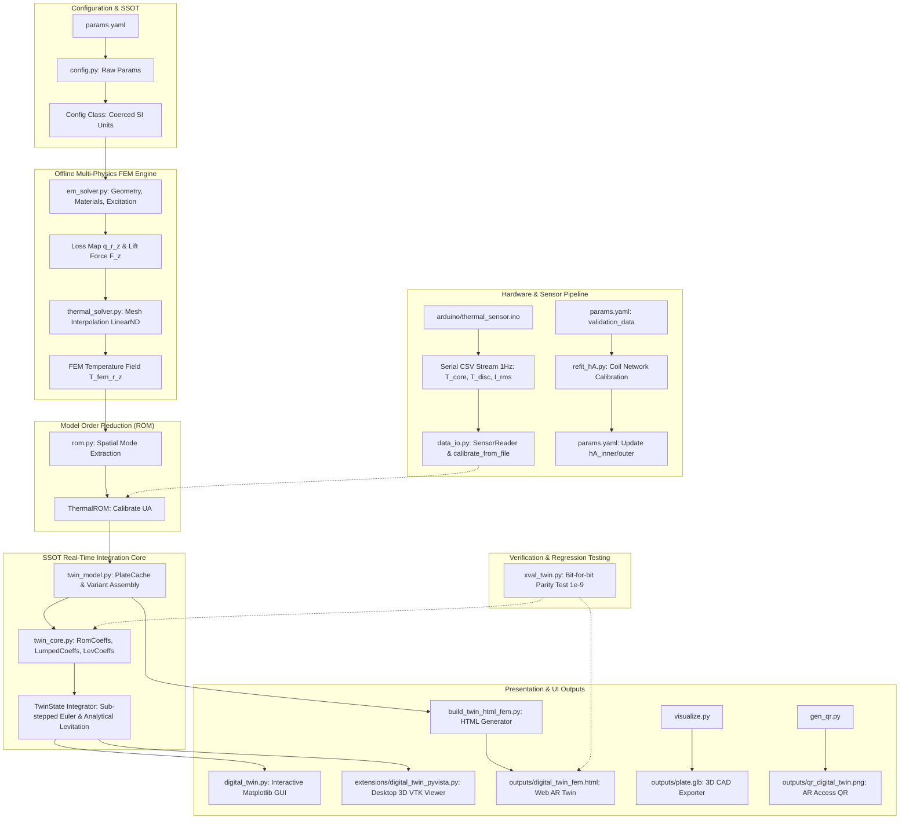
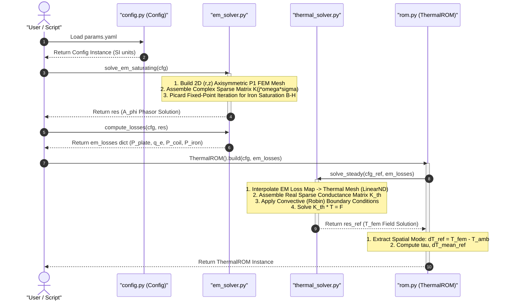
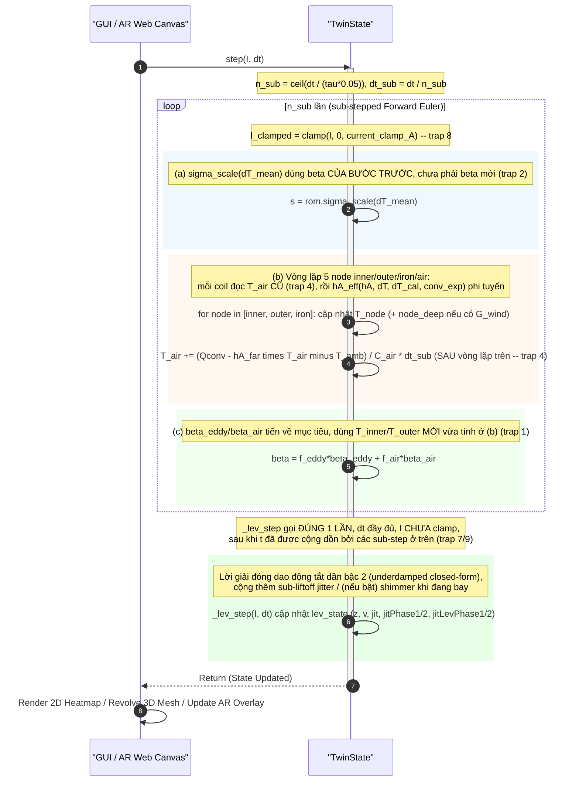
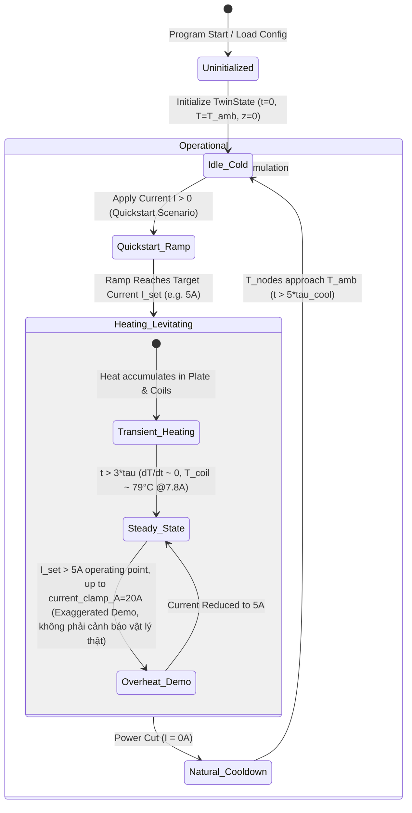
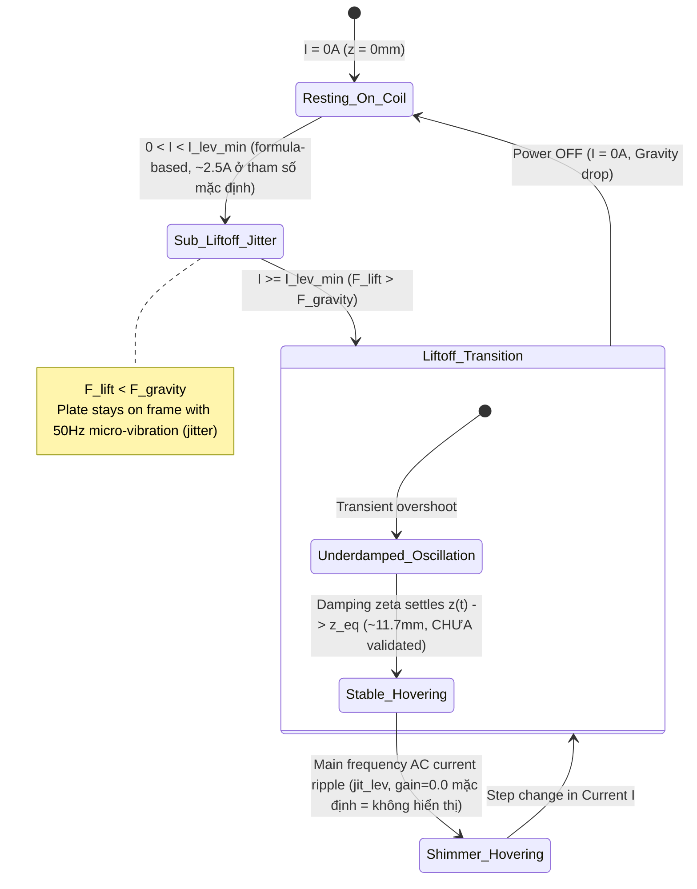
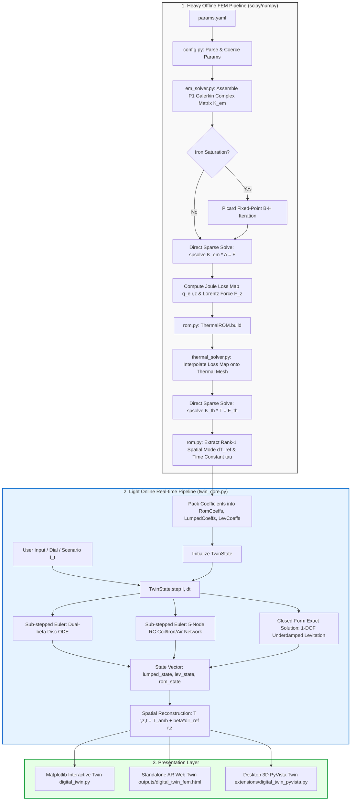
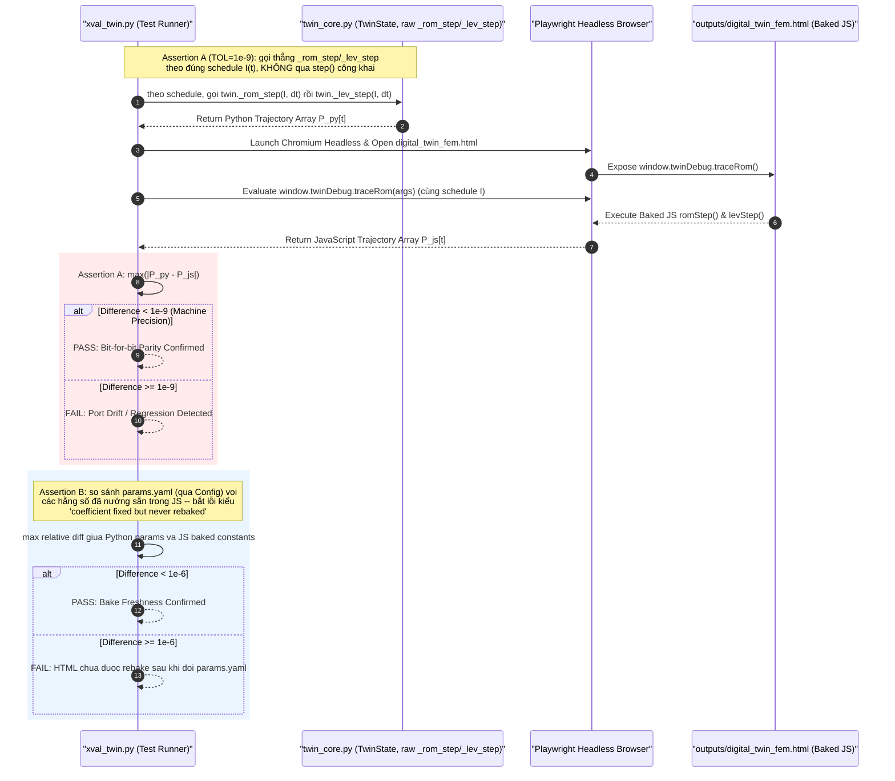

# DT4TM — System UML Diagrams

> **Dự án:** Thermal Digital Twin cho Hệ Thống Nâng Điện Từ (Electrodynamic Levitator - TEAM 28)
> **Tài liệu:** Tổng hợp UML Diagrams (Sơ đồ Kiến trúc, Sơ đồ Lớp, Sơ đồ Tuần tự, Sơ đồ Trạng thái và Sơ đồ Dòng Dữ liệu)
> **Ngày cập nhật:** 2026-08-12

---

## 1. Sơ Đồ Thành Phần & Kiến Trúc Hệ Thống (System Component Diagram)

Sơ đồ mô tả cấu trúc phân tầng của hệ thống DT4TM, từ lớp Cấu hình (Single Source of Truth), lớp Mô phỏng Vật lý FEM (Offline), lớp Mô hình Thu nhỏ (ROM), Động cơ Tích phân Thời gian Thực SSOT (`twin_core.py`), đến các giao diện đầu ra (Matplotlib, Web AR, PyVista) và Tích hợp Phần cứng (Arduino Sensor).



---

## 2. Sơ Đồ Lớp & Cấu Trúc Module (Class & Module Diagram)

Sơ đồ lớp chi tiết thể hiện các đối tượng chính trong hệ thống Python, các Dataclass lưu trữ hệ số vật lý, và mối quan hệ giữa chúng. (Lưu ý: `em_solver`, `thermal_solver`, `twin_model` và `digital_twin` đều là module chứa hàm/dataclass độc lập — không có class kiểu "controller/app" nào bọc chúng; đã đối chiếu trực tiếp với source ngày 2026-08-12).

```mermaid
classDiagram
    class Geometry {
        +float plate_radius_m
        +float plate_thickness_m
        +float plate_z_bottom_m
    }

    class Config {
        +dict raw
        +Geometry geometry
        +float I
        +float I_peak
        +float I_ref
        +float freq
        +float omega
        +float power_ref_W
        +float total_power_W
        +dial_to_current_A(dial) float
        +dial_to_voltage_V(dial) float
    }

    namespace em_solver_py {
        class em_solver_functions {
            +solve_em(cfg) Tuple
            +solve_em_saturating(cfg) Tuple
            +compute_losses(cfg, res) Dict
            +compute_lift_force(cfg, res) float
            +check_saturation(res) float
        }
    }

    namespace thermal_solver_py {
        class thermal_solver_functions {
            +solve_steady(cfg, em_losses) Tuple
            +_interp_em_losses(em_losses, rc_e, zc_e) ndarray
            +energy_balance(res) float
        }
    }

    class ThermalROM {
        +Config cfg
        +float tau
        +float dT_mean_ref
        +ndarray dT_ref
        +float alpha
        +build(cfg, em_losses) ThermalROM
        +simulate(I_of_t, t_arr) Tuple
        +T_steady(I) ndarray
        +_sigma_scale(dT_mean_K) float
    }

    class RomState {
        +float beta
        +float beta_eddy
        +float beta_air
    }

    class LumpedState {
        +Dict~str, float~ T
        +at_ambient(T_amb) LumpedState
    }

    class LevState {
        +float z
        +float v
        +float jit
        +float jitPhase1
        +float jitPhase2
        +float jitLevPhase1
        +float jitLevPhase2
    }

    class TwinState {
        +RomCoeffs rom
        +LumpedCoeffs lumped
        +LevCoeffs lev
        +float T_amb
        +float current_clamp_A
        +float t
        +RomState rom_state
        +LumpedState lumped_state
        +LevState lev_state
        +step(I, dt) None
        +reset() None
        -_rom_step(I, dt) None
        -_lev_step(I, dt) None
    }
    note for TwinState "KHÔNG có _lumped_step() riêng: _rom_step()\ntự làm cả (a) mạng RC 5-nút inner/outer/iron/air\nLẪN (b) cập nhật dual-beta disc trong 1 hàm.\nstep() sub-step _rom_step() n_sub lần với I đã\nclamp, rồi gọi _lev_step() ĐÚNG 1 lần với dt đầy\nđủ và I CHƯA clamp — xem trình tự thật ở mục 3.2."

    class ActivePlate {
        +str name
        +dict spec
        +List~str~ plate_names
        +bool is_synthetic
    }

    class PlateVariant {
        +float radius_mm
        +ndarray V
        +ndarray dTe
        +ndarray dTa
        +ndarray Je
        +RomCoeffs rom
        +LevCoeffs lev
        +float P_plate_W
        +object field_lines
    }

    class PlateCache {
        -Config _cfg_base
        -dict _em_base
        -Dict~str, object~ _cache
        +__contains__(name) bool
        +get(name) object
        +get_or_build(name, plate_lib, verbose) object
    }
    note for PlateCache "Cache NHIỀU ROM theo tên tấm (đĩa) được chọn,\nkhông phải một bộ (rom,lumped,lev) cho một Config\nduy nhất — không có method from_config()."

    class twin_model_functions {
        +resolve_active_plate(cfg) ActivePlate
        +i_max_for(cfg) float
        +coeffs_from_live(cfg, em, rom) Tuple
        +build_plate_variant(base_cfg, radius_mm, z_disc_bot_mm) PlateVariant
    }

    class SensorReader {
        +str port
        +int baudrate
        +read_stream()
        +save_csv(filepath, duration_s)
        +load_csv(filepath)$ DataFrame
    }

    class digital_twin_functions {
        +run_live(...) None
    }
    note for digital_twin_functions "digital_twin.py là script thủ tục, KHÔNG có\nclass nào (không có DigitalTwinApp/TwinModel)."

    Config "1" --o "1" Geometry
    TwinState "1" *-- "1" RomState
    TwinState "1" *-- "1" LumpedState
    TwinState "1" *-- "1" LevState
    twin_model_functions ..> ActivePlate : trả về
    twin_model_functions ..> PlateVariant : trả về
    twin_model_functions ..> PlateCache : dùng
    digital_twin_functions ..> TwinState : điều khiển
    digital_twin_functions ..> twin_model_functions : dùng
```



---

## 3. Sơ Đồ Tuần Tự (Sequence Diagrams)

### 3.1. Quy Trình Khởi Tạo & Tính Toán Offline FEM / ROM (Phase 1)

Quy trình giải bài toán trường điện từ AC Phasor, tính toán tổn hao Joule, truyền bản đồ tổn hao sang lưới nhiệt, và trích xuất mô hình thu nhỏ ROM.



---

### 3.2. Vòng Lặp Tích Phân Thời Gian Thực (Phase 2 Runtime - TwinState Integration)

Vòng lặp tính toán thời gian thực. **Không phải 3 bước "song song, đối xứng"**: `_rom_step` gộp CẢ dual-$\beta$ disc LẪN mạng RC 5-nút trong một hàm và bị sub-step nhiều lần với dòng điện đã clamp; `_lev_step` chỉ chạy 1 lần/step, với `dt` đầy đủ và dòng điện KHÔNG clamp, sau khi toàn bộ sub-step trên đã chạy xong (`twin_core.py` tự đánh số các điểm dễ nhầm này là "trap 1"–"trap 9").



---

### 3.3. Quy Trình Hiệu Chỉnh Phần Cứng (Phase 3 Hardware Calibration)

Quy trình hiệu chỉnh chia làm 2 luồng độc lập: Hiệu chỉnh mô hình đĩa (ROM UA) thông qua dữ liệu CSV thời gian thực, và Hiệu chỉnh mạng nhiệt cuộn dây (Coil Network) thông qua dữ liệu chuẩn (validation_data).

```mermaid
sequenceDiagram
    autonumber
    
    box rgb(245, 245, 255) Disc ROM Calibration (data_io.py)
    actor Sensor as "Arduino (MAX31855)"
    participant IO as "data_io.py (SensorReader)"
    participant ROM as "rom.py (ThermalROM)"
    
    Sensor->>IO: Serial Stream CSV cols t, T_core, T_disc, I_rms
    IO->>IO: save_csv() & load_csv()
    IO->>IO: calibrate_from_file()
    IO->>ROM: calibrate_UA(I_meas, dT_meas)
    ROM-->>IO: Return Optimized UA
    end

    box rgb(255, 245, 245) Coil Network Calibration (refit_hA.py)
    participant OPT as "refit_hA.py (fsolve)"
    participant CORE as "twin_core.py (TwinState)"
    participant CFG as "params.yaml"

    OPT->>CFG: Read I_CAL, T_INNER_TARGET, T_OUTER_TARGET
    activate OPT
    OPT->>CORE: Run TwinState 600,000s with trial (hA_inner, hA_outer)
    CORE-->>OPT: Return T_inner_sim, T_outer_sim
    OPT->>OPT: Compute Residuals (Sim - Target) via scipy.optimize.fsolve
    OPT-->>CFG: Print/Update Calibrated hA_inner_W_per_K, hA_outer_W_per_K
    deactivate OPT
    end
```

---

## 4. Sơ Đồ Trạng Thái (State Diagrams)

### 4.1. Trạng Thái Vận Hành Của Digital Twin (`TwinState Lifecycle`)

> ⚠️ Đây là góc nhìn khái niệm (conceptual) để minh hoạ hành vi liên tục của các ODE trong
> `TwinState`, **không phải một FSM/enum thật trong code** — không có `State` class hay
> `if state == ...` nào trong `twin_core.py`. `Overheat_Warning` bên dưới cũng không phải
> một ngưỡng cứng trong code; nó minh hoạ cho `current_clamp_A` (mặc định 20.0 A trong
> `TwinState`, [twin_core.py](../twin_core.py)) và ghi chú của CLAUDE.md: *"Raise it (e.g.
> 20A) only for an exaggerated heating demo"*.



---

### 4.2. Trạng Thái Cơ Học Nâng (Levitation Mechanics States)

> ⚠️ Góc nhìn khái niệm, không phải FSM thật (xem caveat ở 4.1). Ba điểm cần đọc kèm:
> 1. `I_liftoff` **không phải hằng số cố định** — nó là `LevCoeffs.I_lev_min =
>    5·exp(-z_gap_5A_mm / (2·z_decay_mm))`, tính từ tham số hình học/độ suy giảm
>    ([twin_core.py:291](../twin_core.py#L291)); ~2.5A chỉ là giá trị xấp xỉ ở bộ tham số mặc định.
> 2. `z_eq (~11.7mm)` **CHƯA được validate** — CLAUDE.md mục "OPEN QUESTIONS" ghi rõ lệch
>    ~7mm so với khe hở đo thực tế (7–8mm), nghi do `mu_r=1000` (đặt tạm, chưa đo) — không
>    nên coi số này là đã kiểm chứng.
> 3. `Shimmer_Hovering`: với tham số mặc định hiện tại `lev_ripple_display_gain = 0.0`
>    (đã tắt từ WP-SHIMMER V2, xem `docs/physics.md` §11 "SUPERSEDED same day") nên trạng
>    thái này **không tạo rung hiển thị nào** — chỉ còn rung sub-liftoff (`jit_contact`,
>    trạng thái `Sub_Liftoff_Jitter`) là còn hoạt động theo mặc định.



---

## 5. Sơ Đồ Hoạt Động & Dòng Dữ Liệu (Data Flow & Activity Diagram)

Sơ đồ thể hiện sự chuyển hóa giữa **Chuỗi Tính Toán Tốn Chi Phí (Offline Heavy Computation Pipeline)** và **Chuỗi Thời Gian Thực (Online Real-time Execution Pipeline)**.



---

## 6. Kiểm Trợ & Đồng Bộ Cross-Validation Diagram

Sơ đồ mô tả quy trình kiểm định tự động (`xval_twin.py`) đảm bảo tính đồng nhất 100% (bằng số bit) giữa động cơ Python `twin_core.py` và động cơ JavaScript được nướng vào trang Web AR HTML `outputs/digital_twin_fem.html`. **Lưu ý quan trọng:** không có method `TwinState.step_scenario()` nào cả — Assertion A cố ý gọi TRỰC TIẾP `_rom_step`/`_lev_step` (bỏ qua `TwinState.step()` công khai) để mirror đúng vòng lặp thô của `traceRom()` phía JS, tránh việc sub-stepping/clamp của `step()` làm nhiễu phép so sánh. `xval_twin.py` còn có Assertion B (bake-freshness, rel-diff) không nằm trong sơ đồ gốc — đã bổ sung bên dưới vì đây là nửa còn lại của cùng một test.


