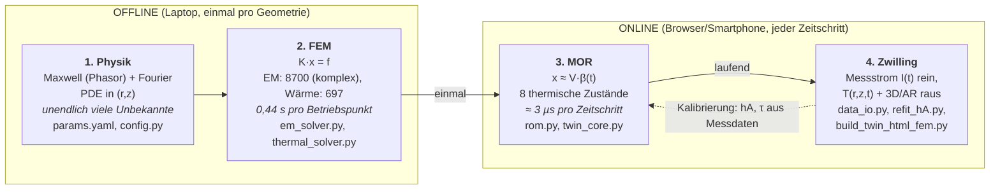

# Vom Feldmodell zum Echtzeit-Zwilling: Modellordnungsreduktion für den thermischen Digital Twin eines elektrodynamischen Levitators

**Dang Minh Hoang, Marina Borchert, Mohamed Aziz El Majid**
Project Course Digital Twin, Summer Term 2026 · Betreuung: Prof. Dr. rer. nat. Dirk Hartmann, Dr.-Ing. Melina Merkel

> **Stand: 26.09.2026 · Version 1**
> Lesefassung (Markdown) von `project_course_final.tex`, inhaltlich identisch.
> Die LaTeX-Datei ist das Abgabedokument; bei Änderungen beide Dateien und dieses Datum anpassen.
>
> | Version | Datum | Änderung |
> |---|---|---|
> | 1 | 26.09.2026 | Erste Fassung: Methodik FEM → MOR → Zwilling, Eigenwertanalyse, Code-Dokumentation, Lessons Learned |

---

## Abstract

Ein digitaler Zwilling soll die Temperatur von Scheibe und Spulen eines TEAM-28-ähnlichen Levitators vorhersagen, und zwar laufend, aus dem gemessenen Spulenstrom, auf einem Smartphone. Dieser Bericht erklärt den Weg dorthin als Kette aus vier Schritten: (1) Physik als partielle Differentialgleichungen, (2) deren Lösung mit der Finite-Elemente-Methode (FEM) als großes lineares Gleichungssystem, (3) die Reduktion dieses Systems auf wenige Zustandsgrößen (*Model Order Reduction*, MOR) und (4) die Kalibrierung der reduzierten Parameter an Messdaten. Kern des Berichts ist die Begründung von Schritt 3: Aus 8700 komplexen EM-Unbekannten und 697 thermischen Unbekannten wird ein Modell mit acht thermischen Zuständen, dessen Zeitschritt ≈ 3 µs dauert. Eine Eigenwertanalyse der Wärme-FEM zeigt, warum das zulässig ist: Die langsamste Zeitkonstante (204 s) ist 47-mal größer als die nächste, eine einzige Mode gibt die volle FEM-Transiente daher mit ≤ 0,36 K Fehler wieder. Zugleich dokumentiert der Bericht den Code so, dass seine Funktion ohne Lektüre des Quelltexts nachvollziehbar ist, und fasst Endergebnisse, offene Punkte und Lessons Learned zusammen.

---

## I. Einleitung: Was soll der Zwilling leisten?

Der Versuchsstand ist ein elektrodynamischer Levitator nach dem TEAM-Benchmark 28 [1]: Zwei Wechselstromspulen (50 Hz) induzieren in einer Aluminiumscheibe Wirbelströme, die Scheibe schwebt. Dieselben Ströme erzeugen Wärme in Scheibe, Spulen und Eisen. Abb. 1 zeigt den Aufbau, Tabelle I die vermessenen Maße.

Die Temperatur in der schwebenden Scheibe oder im Inneren der Wicklung lässt sich im Betrieb kaum messen: Ein Thermoelement an der Scheibe stört die Levitation, und blankes Aluminium ist für die IR-Kamera wegen seiner unbekannten Emissivität unzuverlässig. Genau das ist der Anwendungsfall *virtueller Sensor*, den Hartmann und Van der Auweraer für den Anlauf großer Elektromotoren beschreiben [2]: Eine nicht messbare Temperatur wird aus einer messbaren Größe (dort Statorsensoren, hier der Spulenstrom) über ein physikalisches Modell berechnet. Daraus folgen drei Anforderungen:

1. **Echtzeit:** Das Modell muss mit dem Messtakt (1 Hz) mitlaufen, auch auf einem Smartphone im Browser.
2. **Physikalische Treue:** Es muss aus Maxwell- und Wärmeleitungsgleichung abgeleitet sein, nicht bloß an Daten angepasst.
3. **Kalibrierbarkeit:** Die wenigen unsicheren Parameter (Wärmeübergang) müssen sich an Messungen nachstellen lassen.

(1) und (2) widersprechen sich auf den ersten Blick: Genaue Modelle sind groß und langsam, schnelle Modelle ungenau. Die Methode, die beide Anforderungen verbindet, ist die Modellordnungsreduktion, die Hartmann et al. als Schlüsseltechnologie für digitale Zwillinge bezeichnen [3]. Dieser Bericht erklärt sie am konkreten Beispiel. Abb. 2 dient dabei als Leitfaden: Die Abschnitte II–VI behandeln je einen Kasten.

**Abb. 1 — Halber Querschnitt des Geräts** (rotationssymmetrisch um r = 0), identisch zur Eingabe in `params.yaml`. Weil sich um die Achse nichts ändert, genügt es, diese 2D-Ebene (r, z) zu rechnen.

```
 r=0
  ┆  ┌──────────── Al-Scheibe, R=80, d=3 [mm] ────────────┐   ↕ z_gap
  ┆  └────────────────────────────────────────────────────┘
  ┆
  ┆┌─────────┐ ┌──────────────┐ ┌──────┐ ┌────────┐
  ┆│Eisenkern│ │ Innenspule   │ │Eisen-│ │ Außen- │
  ┆│ µr=1000 │ │   N=1000     │ │ ring │ │ spule  │   Höhe 53 mm
  ┆│         │ │              │ │      │ │ N=500  │
  ┆└─────────┘ └──────────────┘ └──────┘ └────────┘
  └──────────┬──────────────┬────────┬──────────┬──→ r [mm]
           25,9           61,9     79,9      102,9
```

**Tabelle I — Vermessene Geometrie und Materialwerte (`params.yaml`)**

| Bauteil | r [mm] | µr | σ [MS/m] | N |
|---|---|---|---|---|
| Eisenkern | 0,0–25,9 | 1000\* | 1,0\* | – |
| Innenspule (Cu) | 27,9–61,9 | 1 | 59,6 | 1000 |
| Eisenring | 64,9–79,9 | 1000\* | 1,0\* | – |
| Außenspule (Cu) | 82,9–102,9 | 1 | 59,6 | 500 |
| Al-Scheibe (d = 3 mm) | 0,0–80,0 | 1 | 34,0 | – |

Höhe von Kern, Spulen und Ring: 53 mm. Betriebspunkt I_rms = 5 A, f = 50 Hz; Kalibrierpunkt 7,8 A. \*Literaturwerte, nicht gemessen (Abschnitt VIII).

**Abb. 2 — Leitfaden des Berichts und zugleich Architektur des Codes.** Die teure Rechnung (Offline) läuft einmal; im Betrieb (Online) läuft nur das reduzierte Modell. Unter jedem Schritt stehen die Dateien, die ihn umsetzen (Details in Tabelle V).



---

## II. Schritt 1: Vom Phänomen zur Gleichung

Die Physik ist eine Kette: *Strom → Magnetfeld → Wirbelstrom → Wärme → Temperatur*. Jedes Glied ist eine Gleichung.

**Magnetfeld.** Wegen der Rotationssymmetrie hat das magnetische Vektorpotential nur eine Komponente $A_\varphi(r,z)$. Da der Strom sinusförmig ist, wird nicht der Zeitverlauf gerechnet, sondern Amplitude und Phase als komplexe Zahl, der *Phasor* [4]:

$$
-\nabla\cdot(\nu\nabla A_\varphi) + \frac{\nu}{r^2}A_\varphi + j\omega\sigma A_\varphi = J_s,\qquad \nu=\frac{1}{\mu_r\mu_0}. \tag{1}
$$

*Lesehilfe:* Der erste Term beschreibt, wie sich das Feld im Raum ausbreitet (Eisen mit großem $\mu_r$ bündelt es), der zweite ist der geometrische Preis der Zylinderkoordinaten, der dritte ist die Gegenwehr jedes Leiters: Das Wechselfeld induziert dort Wirbelströme, die dem Feld entgegenwirken. $J_s$ ist die Stromdichte in den Spulen, die Quelle.

**Wärmequelle.** Aus dem Feld folgt die über eine Periode gemittelte Verlustdichte im Leiter:

$$
q(r,z) = \tfrac12\,\sigma\,\omega^2\,|A_\varphi|^2 \quad[\mathrm{W/m^3}]. \tag{2}
$$

Die Spulen selbst erwärmen sich ohmsch mit $P_{\mathrm{Cu}}=\tfrac12 I^2R$.

**Temperatur.** Die Wärme verteilt sich nach der Fourier-Gleichung und wird an der Oberfläche durch Konvektion abgegeben:

$$
\rho c_p\frac{\partial T}{\partial t}=\nabla\cdot(k\nabla T)+q,\qquad -k\frac{\partial T}{\partial n}=h\,(T-T_\infty). \tag{3}
$$

> **Kernidee.** Zwei Zeitskalen: Das Feld schwingt mit 50 Hz (20 ms), die Temperatur ändert sich über Minuten. Das sind vier bis fünf Größenordnungen. Die Thermik spürt nur den Mittelwert der Verluste, deshalb wird das Feld einmal als Phasor gelöst und nie im 50-Hz-Takt zeitlich integriert. Das ist die erste, noch ganz physikalische Vereinfachung.

---

## III. Schritt 2: Wie die FEM die Gleichung löst

Gl. (1) und (3) haben für diese Geometrie keine geschlossene Lösung. Die FEM ersetzt die gesuchte Funktion durch endlich viele Zahlen in drei Schritten:

**(a) Zerlegen.** Die Ebene (r, z) wird in Dreiecke zerlegt (Abb. 3). Unbekannt ist nur noch der Wert in jedem Eckpunkt (Knoten); dazwischen wird linear interpoliert (P1-Elemente). Jeder Knoten $i$ besitzt eine „Zeltfunktion“ $v_i$, die an ihm 1 und an allen anderen Knoten 0 ist.

**(b) Bilanz je Knoten (schwache Form).** Statt die Gleichung in jedem Punkt zu erfüllen, verlangt man, dass sie *gewichtet mit jeder Zeltfunktion* im Mittel erfüllt ist. Für die Wärmeleitung heißt das anschaulich: Um jeden Knoten herum muss die hineingeleitete, erzeugte und abgegebene Wärme bilanziert sein. Mathematisch (stationär, mit dem Volumenfaktor $2\pi r$ der Rotation):

$$
\int_\Omega k\nabla T\cdot\nabla v_i\,2\pi r\,dA + \oint_\Gamma hTv_i\,2\pi r\,ds = \int_\Omega q\,v_i\,2\pi r\,dA+\oint_\Gamma hT_\infty v_i\,2\pi r\,ds . \tag{4}
$$

**(c) Gleichungssystem.** Setzt man $T=\sum_j T_jv_j$ ein, wird aus (4) für alle Knoten zusammen

$$
\mathbf K\,\mathbf T=\mathbf f,\qquad\text{instationär:}\quad \mathbf M\,\dot{\mathbf T}+\mathbf K\,\mathbf T=\mathbf f . \tag{5}
$$

$\mathbf K$ (Leitung + Konvektion) und $\mathbf M$ (Wärmekapazität) sind dünn besetzt, weil jeder Knoten nur mit seinen Nachbarn koppelt. Für das EM-Problem entsteht dasselbe mit komplexem $\mathbf K$ (wegen $j\omega\sigma$). Beide Systeme werden mit dem direkten Löser `scipy.sparse.linalg.spsolve` [5] gelöst.

**Abb. 3 — Idee der FEM.** Die Temperatur ist nur in den Knoten unbekannt. Die Zeltfunktion $v_i$ (links: ihr Träger, markiert mit `#`; rechts: 1D-Schnitt) koppelt Knoten $i$ nur mit seinen direkten Nachbarn, daher ist $\mathbf K$ fast überall null.

```
  z                                        v_i
  ↑  •────•────•────•────•                  1 ┤      /\
  │  │  ╱ │  ╱#│##╱ │  ╱ │                    │     /  \
  │  │ ╱  │ ╱##│#╱##│ ╱  │                    │    /    \
  │  •────•────◉────•────•   ◉ = Knoten i     0 ┼───/      \───→ r
  │  │  ╱#│##╱#│##╱ │  ╱ │                        r_{i-1} r_i r_{i+1}
  │  │ ╱##│#╱##│ ╱  │ ╱  │
  │  •────•────•────•────•
  └──────────────────────────→ r
```

**Warum 2D genügt und das Netz grob sein darf.** Die Rotationssymmetrie reduziert 3D auf 2D. Die Skintiefe in Aluminium bei 50 Hz, $\delta=\sqrt{2/(\omega\mu\sigma)}\approx12\,\mathrm{mm}$, ist viermal größer als die Scheibendicke, der Wirbelstrom ist also über die Dicke fast konstant; ein feines Netz in z ist unnötig. Tabelle II fasst die beiden FEM-Modelle zusammen.

**Tabelle II — Die beiden hochaufgelösten Modelle** (gemessen auf einem Apple-M-Laptop, Python/SciPy)

| | EM-FEM | Wärme-FEM (Scheibe) |
|---|---|---|
| Gleichung | (1), komplex | (3), reell, SPD |
| Gebiet | 1 × 1 m | Scheibe R = 80, d = 3 mm |
| Knoten / Dreiecke | 8700 / 17 028 | 697 / 1280 |
| Lösungszeit | 0,40 s | 0,04 s |
| Ergebnis | $q(r,z)$, $P_{\mathrm{Cu}}$, $P_{\mathrm{Fe}}$ | $T(r,z)$ |

**Verifikation.** Drei automatische Prüfungen sichern, dass die Zahlen die Physik und nicht einen Programmierfehler abbilden:

- *Energiebilanz:* erzeugte Wärme $\int q\,dV$ = abgegebene Wärme $\oint h(T-T_\infty)\,dA$, Abweichung 0,000 %.
- *Gebietsgröße:* Dirichlet- gegen Neumann-Rand am 1 × 1 m-Gebiet, alle Verluste < 1 % verschieden (größte: $P_{\mathrm{Scheibe}}$, 0,77 %).
- *Linearität:* volle Neulösung bei doppeltem Strom liefert $P(2I)/P(I)=3{,}998$ (Sollwert 4).

> **Kernidee.** Die FEM macht aus einer Feldgleichung ein lineares Gleichungssystem $\mathbf K\mathbf x=\mathbf f$ mit tausenden Unbekannten, jede ein Knotenwert. Das ist genau, aber jede Frage („wie warm bei 6 A?“, „wie warm in 30 s?“) verlangt eine neue Lösung.

---

## IV. Warum die FEM allein noch kein Zwilling ist

Tabelle II zeigt: In 2D ist die FEM mit 0,44 s pro Betriebspunkt schon schnell. Das ehrliche Argument für die Reduktion ist daher nicht nur Rechenzeit, sondern die Einsatzumgebung eines Zwillings:

1. **Viele Anfragen statt einer.** Der Zwilling rechnet in jedem Zeitschritt, bei jeder Stromänderung, und korrigiert $\sigma(T)$ fortlaufend. Mit voller FEM hieße das je Schritt eine EM- und eine Wärmelösung.
2. **Zielgerät ohne Löser.** Die AR-Ansicht läuft als einzelne HTML-Datei im Handy-Browser. Dort gibt es kein SciPy, keinen dünnbesetzten LU-Löser und nur wenig Speicher.
3. **Kalibrierung.** Aus einer Messkurve lassen sich keine 697 Knotenwerte fitten, wohl aber wenige physikalisch interpretierbare Größen wie $\tau$ oder $hA$.
4. **Skalierung.** In 3D oder bei gekoppelten Baugruppen wächst die FEM auf $10^5$–$10^7$ Unbekannte, dort ist sie für den Betrieb schlicht zu langsam [2]. Unser 2D-Fall ist das überschaubare Lehrbeispiel desselben Prinzips.

Hartmann et al. formulieren die Lösung als Trennung in *Offline*- und *Online*-Phase [3]: Offline wird das große Modell einmal (oder wenige Male) gelöst und daraus ein kleines Modell extrahiert; online läuft nur noch dieses (Abb. 2).

---

## V. Schritt 3: Modellordnungsreduktion

### A. Die allgemeine Idee

Das FEM-System (5) hat $N$ Unbekannte. Die meisten davon bewegen sich aber nicht unabhängig: Heizt man die Scheibe auf, ändert sich vor allem *wie stark* sie warm ist, kaum *wo*. Projektionsbasierte MOR [6] nutzt das und schreibt das Feld als Kombination weniger fester Formen (Basisvektoren) $\mathbf V=[\mathbf v_1,\dots,\mathbf v_r]$ mit $r\ll N$:

$$
\mathbf T(t)\approx T_\infty+\mathbf V\boldsymbol\beta(t),\qquad \underbrace{\mathbf V^{\top}\mathbf M\mathbf V}_{r\times r}\dot{\boldsymbol\beta} + \underbrace{\mathbf V^{\top}\mathbf K\mathbf V}_{r\times r}\boldsymbol\beta = \mathbf V^{\top}\tilde{\mathbf f}. \tag{6}
$$

Statt $N$ Knotentemperaturen werden nur noch $r$ Amplituden $\beta$ integriert. Die Kunst liegt in der Wahl von $\mathbf V$ und im Nachweis, dass wenige Formen ausreichen.

> **Kernidee.** Wie ein Foto, das nur heller oder dunkler wird: Statt jedes Pixel einzeln zu speichern, speichert man das Bild einmal und merkt sich pro Zeitpunkt nur einen Helligkeitsfaktor.

Im Projekt kommen drei Reduktionen zum Einsatz, jede durch eine physikalische Eigenschaft begründet.

### B. Reduktion A: Linearität der Elektromagnetik ($I^2$-Skalierung)

Gl. (1) ist bei festem $\omega$ und konstantem $\mu_r$ linear in $J_s\propto I$, also ist $A_\varphi\propto I$ und nach (2) $q\propto I^2$. Die *Form* der Verlustkarte hängt vom Strom gar nicht ab. Die EM-FEM wird daher einmal beim Referenzstrom $I_{\mathrm{ref}}$ gelöst, danach gilt exakt

$$
q(r,z;I,\bar T)=\hat q(r,z)\Big(\frac{I}{I_{\mathrm{ref}}}\Big)^{2} \frac{\sigma(\bar T)}{\sigma(T_{\mathrm{ref}})},\qquad \sigma(T)=\frac{\sigma_0}{1+\alpha(T-T_0)} . \tag{7}
$$

Der Faktor $\sigma(\bar T)$ ($\alpha\approx3{,}9\cdot10^{-3}\,\mathrm K^{-1}$) berücksichtigt, dass heißes Aluminium schlechter leitet und damit weniger Wirbelstromverlust erzeugt. Da sich Temperatur über Minuten und das Feld sofort einstellt, wird $\bar T$ aus dem vorigen Zeitschritt genommen. In der Sprache der MOR ist das eine parametrische Reduktion mit einem einzigen, exakt bekannten Basisvektor $\hat q$: 8700 komplexe Unbekannte werden zu einer Multiplikation. Gültig ist das, solange das Eisen nicht sättigt; berechnet wird $B_{\max}=0{,}66\,\mathrm T$ (Effektivwert, Spitze 0,94 T) gegen $B_{\mathrm{sat}}\approx1{,}5\,\mathrm T$.

### C. Reduktion B: Eine Mode für die Scheibe

Für die Wärme-FEM der Scheibe wählt der Code als einzigen Basisvektor das stationäre Temperaturfeld beim Referenzstrom, $\mathbf v_1=\Delta\mathbf T_{\mathrm{ref}}=\mathbf T_{\mathrm{FEM}}-T_\infty$ (ein *Snapshot*). Damit wird (6) zu einer einzigen Gleichung erster Ordnung:

$$
\tau\,\dot\beta=\Big(\frac{I}{I_{\mathrm{ref}}}\Big)^{2}s(\beta)-\beta,\qquad T(r,z,t)=T_\infty+\beta(t)\,\Delta T_{\mathrm{ref}}(r,z), \tag{8}
$$

mit dem $\sigma(T)$-Faktor $s(\beta)$ aus (7) und $\tau=C/UA$, wobei $C=\rho c_p V=146{,}6\,\mathrm{J/K}$ und $UA=P_{\mathrm{ref}}/\overline{\Delta T}_{\mathrm{ref}}$.

**Warum reicht eine Mode?** Das lässt sich prüfen statt behaupten. Das verallgemeinerte Eigenwertproblem $\mathbf K\boldsymbol\varphi=\lambda\mathbf M\boldsymbol\varphi$ der Wärme-FEM liefert die Zeitkonstanten $\tau_i=1/\lambda_i$ aller 697 Eigenformen. Die ersten lauten

$$
\tau_1=203{,}9\,\mathrm s,\quad \tau_2=4{,}38\,\mathrm s,\quad \tau_3=1{,}33\,\mathrm s,\quad \tau_4=0{,}64\,\mathrm s .
$$

Alle Formen außer der ersten klingen also nach wenigen Sekunden ab, während die erste die Minuten-Dynamik trägt. Diese *spektrale Lücke* $\tau_1/\tau_2\approx47$ ist die mathematische Rechtfertigung für $r=1$. Physikalisch ist es die kleine Biot-Zahl $\mathrm{Bi}=h\,(d/2)/k\approx25\cdot0{,}0015/237\approx2\cdot10^{-4}$: Aluminium leitet so gut, dass die Scheibe nahezu gleichmäßig warm wird ($\Delta T_{\mathrm{ref}}$ variiert nur zwischen 42,5 und 43,4 K).


**Abb. 4 — Aufheizen der Scheibe bei $I_{\mathrm{ref}}$ aus Umgebungstemperatur.** Schwarz: volle instationäre FEM (697 Unbekannte, implizites Euler, Δt = 1 s). Blau: Ein-Moden-ROM mit $\tau_1$ aus dem Eigenproblem. Orange: ROM, wie es im Code steht ($\tau=C/UA=244\,$s). Unten: größter Fehler über alle Knoten.

**Ergebnis gegen die volle FEM.** Abb. 4 vergleicht die reduzierte mit der vollen instationären Lösung. Mit der Zeitkonstante $\tau_1$ aus dem Eigenproblem ist der größte Fehler über alle Knoten und Zeiten 0,36 K (0,8 % des Endwerts); die Reduktion 697 → 1 kostet also praktisch keine Genauigkeit. Das im Code verwendete $\tau=C/UA=244\,$s liegt dagegen 20 % über $\tau_1$ und erzeugt während des Aufheizens bis zu 3,0 K (6,9 %) Abweichung; stationär stimmen beide exakt.

> **Anmerkung 1 (Ursache der 20 %).** $UA$ wird gegen $T_\infty=20\,$°C gebildet, die Unterseite der Scheibe sieht aber die von den Spulen vorgewärmte Luft ($T_{\infty,\mathrm{bot}}=30\,$°C). Das effektive $UA$ ist dadurch kleiner als die tatsächliche Wärmeabgabe $\mathbf 1^{\top}\mathbf K\mathbf 1=0{,}719\,\mathrm{W/K}$, aus der $\tau_1=C/0{,}719$ folgt. Im Zwilling wird die Luftvorwärmung allerdings ohnehin als eigener, langsamer Anteil $\beta_{\mathrm{air}}$ modelliert (Abschnitt VII), während die FEM-Referenz hier eine sofort warme Luft annimmt. Welche Zeitkonstante am realen Aufbau richtig ist, kann erst eine gemessene Aufheiz-/Abkühlkurve entscheiden (Abschnitt VIII).

### D. Reduktion C: Konzentriertes RC-Netz für Spulen und Eisen

Spulen und Eisen haben keine eigene Wärme-FEM. Sie werden als thermisches RC-Netz modelliert, wie es für Elektromotoren etabliert ist [7]: Jeder Körper ist ein Knoten mit Wärmekapazität $C_i$, verbunden über Leitwerte $G_{ij}$ und an die Luft über $hA_i$:

$$
C_i\,\dot T_i=P_i(I)+\sum_j G_{ij}(T_j-T_i)-hA_i\,(T_i-T_{\mathrm{air}}). \tag{9}
$$

Das Netz hat sechs Knoten: je Spule eine IR-sichtbare Oberfläche und ein träges Wicklungsinneres, den Eisenkern und einen gemeinsamen Luftknoten. Die Verluste $P_i$ kommen aus der EM-FEM und skalieren nach (7); $C_i$ folgt aus Geometrie und Material. Dieses Modell ist nicht aus der FEM projiziert, sondern physikalisch aufgestellt (*grey box*). Sein Vorteil ist Kalibrierbarkeit: Jeder Parameter hat eine Bedeutung und lässt sich einzeln an Messdaten anpassen (Schritt 4).

> **Kernidee.** Aus 8700 + 697 Unbekannten werden acht Zustandsgrößen: zwei Amplituden für die Scheibe und sechs Knotentemperaturen. Jede Reduktion ist durch eine prüfbare Eigenschaft begründet: Linearität (A), spektrale Lücke (B), gut leitende, kompakte Körper (C).

---

## VI. Schritt 4: Kalibrierung und Betrieb

**Kalibrierung.** Unsicher sind vor allem die Wärmeübergänge $hA_{\mathrm{innen}}$, $hA_{\mathrm{außen}}$. Sie werden gegen die IR-Messung im stationären Zustand bei 7,8 A gefittet (Innenspule 79 °C, Außenspule 74 °C, Umgebung 29 °C). `refit_hA.py` löst dazu per Nullstellensuche das *vollständige* nichtlineare Online-Modell bis zum stationären Zustand, nicht eine von Hand linearisierte Formel. Ergebnis: $hA_{\mathrm{innen}}=2{,}474\,\mathrm{W/K}$, $hA_{\mathrm{außen}}=2{,}889\,\mathrm{W/K}$.

**Betrieb.** Online erhält das Modell jede Sekunde den gemessenen Effektivstrom (Hall-Sensor ACS712 am Arduino, `data_io.py`) und macht einen Zeitschritt. Ein Schritt ist reine Skalararithmetik und kostet in Python ≈ 3,2 µs; dieselbe Rechnung läuft als JavaScript in der AR-Ansicht auf dem Smartphone. Das gespeicherte Temperaturfeld $\Delta T_{\mathrm{ref}}(r,z)$ wird mit $\beta(t)$ multipliziert und für die 3D-Darstellung um die Achse rotiert.

---

## VII. Code-Dokumentation

Dieser Abschnitt beschreibt, was der Code tut, sodass er ohne Lektüre des Quelltexts nachvollziehbar ist. Tabelle V ordnet jede Datei einem Kasten aus Abb. 2 zu.

**Tabelle V — Module, ihre Aufgabe, Ein-/Ausgaben und Methode.** Reihenfolge = Datenfluss.

| Datei | Schritt | Aufgabe | Eingang → Ausgang | Methode / Bibliothek |
|---|---|---|---|---|
| `params.yaml` | 1 | Einzige Quelle aller Zahlen (Geometrie, Material, Randbedingungen, Netz, Kalibrierwerte) | – | YAML; keine Konstante im Code |
| `config.py` | 1 | Lädt und normiert Parameter (mm → m, $I_{\mathrm{peak}}=\sqrt2 I_{\mathrm{rms}}$) | YAML → `Config`-Objekt | PyYAML |
| `em_solver.py` | 2 | EM-Phasor-FEM Gl. (1); Verluste, Hubkraft, Sättigungs- und Gebietsprüfung | Geometrie, I → $A_\varphi$, $q(r,z)$, $P_{\mathrm{Scheibe}}, P_{\mathrm{Fe}}, P_{\mathrm{Cu}}$, $F_z$ | P1-Galerkin, komplex, `spsolve` |
| `thermal_solver.py` | 2 | Stationäre Wärme-FEM Gl. (4) der Scheibe; Energiebilanz | $q(r,z)$ → $T(r,z)$ | P1-Galerkin, `spsolve`, Interpolation EM → Wärmenetz |
| `rom.py` | 3 | Baut Reduktion A+B: speichert $\Delta T_{\mathrm{ref}}$, berechnet $\tau$, $UA$ | FEM-Ergebnis → ROM-Koeffizienten | Snapshot, Energiebilanz |
| `twin_model.py` | 3 | Brücke: berechnet alle Koeffizienten (inkl. RC-Netz) je Scheibenradius | Config, EM, ROM → Koeffizientensätze | Cache je Scheibe |
| `twin_core.py` | 3 | **Der Online-Zwilling.** `TwinState.step(I, dt)` integriert Gl. (8) + (9) + Levitation | I(t) → β, $T_i$, $z_{\mathrm{gap}}$ | expl. Euler mit Teilschritten Δt ≤ 0,05 τ; nur NumPy + stdlib |
| `refit_hA.py` | 4 | Kalibriert $hA_{\mathrm{innen/außen}}$ durch das echte Online-Modell | IR-Messwerte → `params.yaml` | Nullstellensuche |
| `data_io.py` + Arduino | 4 | Liest Messstrom (1 Hz, CSV über USB), treibt `TwinState` | Seriell → $I_{\mathrm{rms}}(t)$ | RMS über 5 Netzperioden |
| `build_twin_html_fem.py` | 4 | „Backt“ Koeffizienten + Online-Modell als JavaScript in eine HTML-Datei (3D/AR) | Koeffizienten → `digital_twin_fem.html` | prozedurale Geometrie, three.js |
| `xval_twin.py` | – | Prüft, dass Python- und JS-Zwilling identisch rechnen | beide → PASS/FAIL | Playwright, Toleranz $10^{-9}$ |

**Ein Durchlauf.** Ruft man `python build_twin_html_fem.py` auf, geschieht Folgendes:

1. `config.py` liest `params.yaml`.
2. `em_solver.py` baut das graduierte Dreiecksnetz des 1 × 1 m-Gebiets, weist jedem Element $\nu$, $\sigma$ und $J_s$ zu, assembliert und löst das komplexe System und integriert daraus die Verluste je Körper.
3. `thermal_solver.py` interpoliert $q$ auf das Scheibennetz, löst die Wärmeleitung und prüft die Energiebilanz.
4. `rom.py` speichert das Feld als Mode und berechnet $\tau$. Zusätzlich wird aus einem zweiten Lauf ohne Spulenluftvorwärmung der Anteil $f_{\mathrm{eddy}}$ bestimmt, den der Wirbelstrom am Scheibenfeld hat (≈ 0,84); der Rest $f_{\mathrm{air}}\approx0{,}16$ folgt der Luft um die Spulen. Online ist $\beta=f_{\mathrm{eddy}}\beta_{\mathrm{eddy}}+f_{\mathrm{air}}\beta_{\mathrm{air}}$.
5. Die Koeffizienten des RC-Netzes werden aus Geometrie und Kalibrierwerten berechnet.
6. Alles wird zusammen mit dem Online-Modell als JavaScript in eine einzige HTML-Datei geschrieben, die ohne eigenen Server im Browser läuft (nur three.js wird vom CDN geladen).

**Zwei Implementierungen, ein Modell.** Das Online-Modell existiert zweimal: als `twin_core.py` (Python-Referenz, genutzt von allen Desktop-Ansichten und dem Sensorpfad) und als eingebettetes JavaScript. `xval_twin.py` startet die HTML-Datei in einem Browser und vergleicht beide über sieben Stromverläufe (absolute Toleranz $10^{-9}$). Eine zweite Prüfung stellt fest, ob die eingebackenen Koeffizienten noch zu `params.yaml` passen. Beide müssen nach jeder Änderung bestehen.

**Levitation.** Nebenbei berechnet der Zwilling die Schwebehöhe: Die EM-FEM liefert die Hubkraft $F_z(z)$, deren Gleichgewicht mit der Gewichtskraft $z_{\mathrm{eq}}$ ergibt; die Bewegung dorthin wird als gedämpfter Feder-Masse-Schwinger in geschlossener Form berechnet.

---

## VIII. Endergebnisse

**Tabelle III — Verlustleistung aus der EM-FEM** (I = 5 A, $T_\infty$ = 20 °C)

| Quelle | P [W] |
|---|---|
| Wirbelstrom Scheibe (Al) | 25,81 |
| Wirbelstrom Eisenkern + -ring | 5,86 |
| Ohmsch Spulen (innen 52,32 + außen 54,12) | 106,44 |
| **Gesamt** | **138,11** |

**Tabelle IV — Aufwand: volles Modell gegen reduziertes Modell**

| | FEM (offline) | ROM (online) |
|---|---|---|
| Unbekannte | 8700 (kompl.) + 697 | 8 Zustände |
| Aufwand | 0,44 s / Betriebspunkt | 3,2 µs / Zeitschritt |
| Benötigt | SciPy, dünnbes. LU | Arithmetik |
| Läuft auf | Laptop | Laptop, Browser, Handy |
| Fehler Scheibe | Referenz | ≤ 0,36 K (1 Mode, $\tau_1$) |

**Verluste.** Tabelle III: Die Spulen erzeugen 77 % der Wärme, die Scheibe 19 %. Das bestätigt die IR-Beobachtung, dass die Innenspule das heißeste Bauteil ist.

**Reduktion.** Tabelle IV: Das Online-Modell ist um rund fünf Größenordnungen schneller als eine volle Neulösung und kommt ohne Löserbibliothek aus. Die Eigenwertanalyse belegt, dass die Reduktion der Scheibe auf eine Mode praktisch verlustfrei ist (Abb. 4).

**Stationäre Validierung.** Am Kalibrierpunkt (7,8 A) trifft der Zwilling die gemessenen Spulentemperaturen exakt (79,00 / 74,00 °C). Das ist ein Kalibrier-, kein unabhängiger Validierungsnachweis.

**Transiente: nicht validiert.** Gegen die einzige vorhandene zeitaufgelöste Messung (Stromrampe, fünf IR-Zeitpunkte der Außenspule) heizt das Modell systematisch zu langsam auf (RMS-Fehler 11,5 K). Kapazitätsaufteilung und innere Leitwerte des RC-Netzes sind aus reinen Aufheizdaten nicht eindeutig bestimmbar; dafür fehlt eine gemessene Abkühlkurve.

**Schwebehöhe: offen.** Berechnet $z_{\mathrm{eq}}\approx11{,}7\,$mm (Unterkante), beobachtet ist ein sichtbarer Spalt von 7–8 mm. Sättigung ist als Ursache ausgeschlossen (< 0,1 % Kraftänderung); wahrscheinlich ist der nicht gemessene Wert $\mu_r=1000$ des Eisens. $\mu_r$ wurde bewusst nicht auf die Beobachtung zurückgefittet.

> **Anmerkung 2 (Stromkonvention).** 5 A ist ein gemessener Effektivwert. Die Verlustkette nutzt ihn bewusst als Amplitude; der konstante Faktor 2 in der Leistung wird beim Fit von $hA$ absorbiert, die Temperaturen bleiben korrekt. Die Kraftkette rechnet mit der echten Amplitude $\sqrt2\cdot5=7{,}07\,$A, weil sich eine Kraft nicht wegkalibrieren lässt.

---

## IX. Lessons Learned

**Was gut lief.**

- *Physik zuerst reduzieren.* Achsensymmetrie (3D → 2D), Phasor (50 Hz nicht integrieren) und Linearität ($I^2$) haben den größten Teil des Aufwands eingespart, bevor überhaupt MOR-Technik nötig war.
- *Harte, automatische Prüfungen.* Energiebilanz, Gebietsgröße, $I^2$-Test und der Python/JS-Abgleich laufen nach jeder Änderung und haben mehrere Fehler gefunden, die sonst unbemerkt geblieben wären.
- *Eine Datei für alle Zahlen.* `params.yaml` als einzige Quelle machte die Nachvermessung der Geometrie zu einer reinen Dateiänderung.
- *Interpretierbares ROM.* Jeder Online-Parameter ($\tau$, $hA$, $C$) ist eine physikalische Größe und damit an Messungen nachstellbar.

**Was schlecht lief.**

- *Zu wenig Messdaten, zu spät.* Ohne Abkühlkurve bleibt die Transiente unvalidiert; die Sensorhardware hätte früher geplant werden müssen.
- *Effektiv- und Spitzenwert verwechselt.* Der Fehler $I_{\mathrm{rms}}$ vs. $\hat I$ wurde zweimal an übersehenen Aufrufstellen ausgeliefert. Lehre: physikalische Konventionen im Code benennen (`I_peak`), nicht im Kopf behalten.
- *Kalibrierung außerhalb des Modells.* Eine von Hand linearisierte Fit-Formel passte nicht zum nichtlinearen Online-Modell (Spulen 7 K zu kalt). Lehre: immer durch das Modell fitten, das tatsächlich läuft.
- *ROM nicht direkt gegen sein FEM geprüft.* Die Abweichung τ = 244 s vs. τ₁ = 204 s fiel erst beim Schreiben dieses Berichts durch die Eigenwertanalyse auf. Ein ROM-gegen-FEM-Test gehört von Anfang an in die Prüfkette.
- *Geometrie spät vermessen.* Bis Juli wurde mit geschätzten Radien gerechnet; nach der Nachmessung stiegen die Scheibenverluste von 3,0 auf 25,8 W.

---

## X. Zusammenfassung und Ausblick

Der thermische Zwilling folgt der Offline/Online-Trennung der Modellordnungsreduktion [3]: Zwei FEM-Modelle werden einmal gelöst, drei physikalisch begründete Reduktionen machen daraus ein Modell mit acht Zuständen, das im Mikrosekundentakt auf einem Smartphone läuft und aus dem gemessenen Strom die Temperatur vorhersagt. Die Eigenwertanalyse zeigt, dass diese Reduktion für die Scheibe nahezu verlustfrei ist, und hat zugleich eine 20 %-Abweichung in der verwendeten Zeitkonstante aufgedeckt. Nächste Schritte:

1. eine gemessene Aufheiz- und Abkühlkurve, um $\tau$ und das RC-Netz zu identifizieren;
2. $\tau$ der Scheibe aus dem Eigenproblem statt aus $C/UA$ ableiten, sobald die Messung zeigt, welche Definition den Aufbau besser trifft;
3. eine Messung von $\mu_r$ zur Klärung der Schwebehöhe.

---

## Literatur

1. International Compumag Society, „Description of TEAM workshop problem 28: An electrodynamic levitation device“, https://www.compumag.org/jsite/images/stories/TEAM/problem28.pdf
2. D. Hartmann, H. Van der Auweraer, „Digital Twins – a golden age for industrial mathematics“, *Journal of Mathematics in Industry*, 15:6, 2025. doi:10.1186/s13362-025-00170-3
3. D. Hartmann, M. Herz, U. Wever, „Model Order Reduction a Key Technology for Digital Twins“, in: W. Keiper, A. Milde, S. Volkwein (Hrsg.), *Reduced-Order Modeling (ROM) for Simulation and Optimization*, Springer, Cham, 2018, S. 167–179. doi:10.1007/978-3-319-75319-5_8
4. O. Bíró, K. Preis, „On the use of the magnetic vector potential in the finite-element analysis of three-dimensional eddy currents“, *IEEE Trans. Magnetics*, 25(4), S. 3145–3159, 1989.
5. P. Virtanen et al., „SciPy 1.0: Fundamental algorithms for scientific computing in Python“, *Nature Methods*, 17, S. 261–272, 2020.
6. P. Benner, S. Gugercin, K. Willcox, „A Survey of Projection-Based Model Reduction Methods for Parametric Dynamical Systems“, *SIAM Review*, 57(4), S. 483–531, 2015. doi:10.1137/130932715
7. O. Wallscheid, „Thermal monitoring of electric motors: State-of-the-art review and future challenges“, *IEEE Open Journal of the Industry Applications Society*, 2, S. 204–223, 2021.

*Hinweis: In der LaTeX-Fassung ist die Nummerierung der Literatur und Tabellen durch BibTeX/LaTeX gesetzt und kann von dieser Lesefassung abweichen.*
