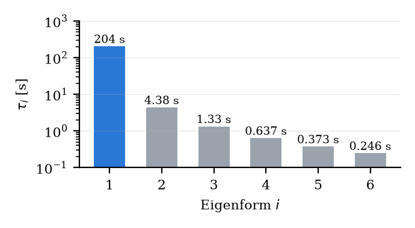
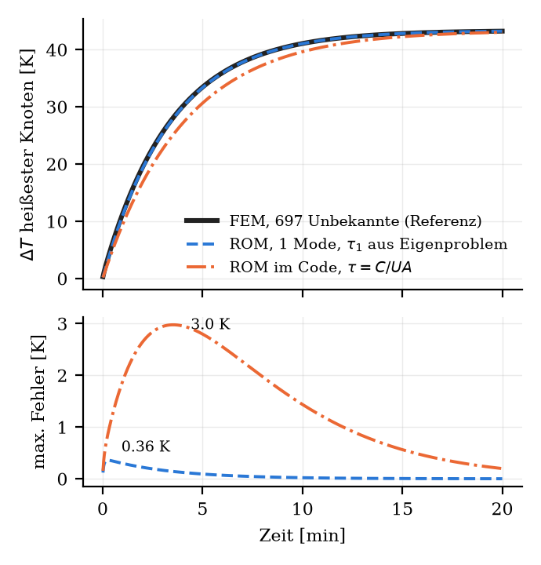
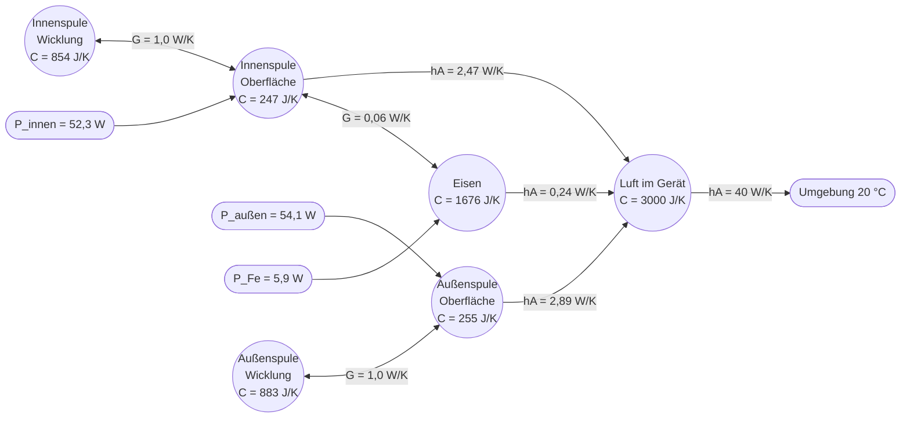

# Vom Feldmodell zum Echtzeit-Zwilling: Modellordnungsreduktion für den thermischen Digital Twin eines elektrodynamischen Levitators

**Dang Minh Hoang, Marina Borchert, Mohamed Aziz El Majid**
Project Course Digital Twin, Summer Term 2026 · Betreuung: Prof. Dr. rer. nat. Dirk Hartmann, Dr.-Ing. Melina Merkel

> **Stand: 26.09.2026 · Version 2**
> Lesefassung (Markdown) von `project_course_final_v2.tex`, inhaltlich identisch. Version 1 (`project_course_final.{md,tex}`) bleibt unverändert erhalten.
> Jede Zahl in diesem Bericht wird von `report_numbers.py` (im selben Ordner) neu berechnet. Die Kennung in eckigen Klammern, z. B. **[E3]**, verweist auf die Zeile der Programmausgabe (`report_numbers_output.txt`) und auf Anhang A.
>
> | Version | Datum | Änderung |
> |---|---|---|
> | 1 | 26.09.2026 | Erste Fassung: Methodik FEM → MOR → Zwilling, Eigenwertanalyse, Code-Dokumentation, Lessons Learned |
> | 2 | 26.09.2026 | Neue Gliederung (Problemstellung / Methodik / Berechnungswerkzeug / Ergebnisse / Ausblick); Methodik (Kap. 3) ausführlich mit Begründung vor den Zahlen; jede Zahl mit Quelle; Anhänge A–E; Korrekturen gegenüber V1 (siehe unten) |
>
> **Korrekturen gegenüber Version 1** (durch Nachrechnen gefunden):
> - $B_{\max}$ im Eisen: V1 nannte 0,66 T (Effektivwert). Nachgerechnet: 0,48 T effektiv bzw. 0,68 T Spitze bei 5 A Phasoramplitude; am realen Betriebspunkt (5 A effektiv) 0,96 T Spitze, am Kalibrierpunkt (7,8 A) **1,50 T Spitze, also an der Sättigungsgrenze** [E5].
> - $I^2$-Test: V1 nannte 3,998. Mit linearem Löser ist das Verhältnis exakt 4,000; mit der im Code standardmäßig aktiven $\mu(B)$-Korrektur 4,009 (gesamt) bzw. 3,994 (Scheibe) [E6].
> - Rechenzeit: V1 nannte „0,44 s pro Betriebspunkt“. Eine lineare EM-Lösung dauert 0,40 s, der vollständige Verlustpfad mit $\mu(B)$-Iteration 1,30 s [E1, E2].
> - Neu aufgedeckt: Der Zwilling sagt für die Scheibe bei 7,8 A 107 °C voraus, für das Wicklungsinnere 178 °C [L3]. Beides ist nicht validiert und wird in Kap. 5.4 diskutiert.

---

## 0. Kurzfassung

Ein digitaler Zwilling soll die Temperatur von Aluminiumscheibe und Spulen eines TEAM-28-ähnlichen Levitators laufend aus dem gemessenen Spulenstrom vorhersagen, und zwar auf einem Smartphone. Genaue Simulationsmodelle sind dafür zu schwerfällig, einfache Faustformeln zu ungenau. Der Bericht zeigt, wie beides verbunden wird: Die Physik wird zunächst als Feldgleichungen formuliert und mit der Finite-Elemente-Methode (FEM) gelöst (8700 komplexe elektromagnetische und 697 thermische Unbekannte). Anschließend wird dieses große Modell durch Modellordnungsreduktion (MOR) auf acht Zustandsgrößen verkleinert, deren Zeitschritt 3,3 µs dauert. Dass diese Verkleinerung zulässig ist, wird nicht angenommen, sondern an drei prüfbaren Eigenschaften nachgewiesen: Linearität, getrennte Zeitskalen und eine große Lücke im Eigenwertspektrum ($\tau_1/\tau_2 = 47$). Gegen die volle FEM weicht die reduzierte Scheibentemperatur um höchstens 0,36 K ab. Gegen den realen Versuchsstand trifft der Zwilling die kalibrierten Spulentemperaturen im stationären Zustand exakt, den zeitlichen Verlauf aber noch nicht (RMS-Fehler 11,5 K); die Ursachen werden benannt. Der Bericht dokumentiert zudem den Code so, dass seine Funktion ohne Lektüre des Quelltexts nachvollziehbar ist.

---

## 1. Einleitung

Der Versuchsstand ist ein elektrodynamischer Levitator nach dem TEAM-Benchmark 28 [1]: Zwei mit 50-Hz-Wechselstrom betriebene Spulen erzeugen ein Magnetfeld, das in einer darüber liegenden Aluminiumscheibe Ströme induziert. Diese Ströme werden vom Feld abgestoßen, die Scheibe schwebt. Dieselben Ströme erzeugen aber auch Wärme, in der Scheibe, in den Spulen und im Eisen.

Genau diese Temperaturen sind im Betrieb schwer zu messen. Ein Thermoelement an der schwebenden Scheibe würde die Levitation stören. Eine IR-Kamera misst auf blankem Aluminium unzuverlässig, weil blankes Metall wenig Wärmestrahlung aussendet und viel Umgebung spiegelt. Das Innere der Wicklung ist von außen gar nicht zugänglich. Messbar ist dagegen der Spulenstrom.

Daraus ergibt sich die Aufgabe eines **virtuellen Sensors**: Eine nicht messbare Größe (Temperatur) wird aus einer messbaren Größe (Strom) über ein physikalisches Modell berechnet. Hartmann und Van der Auweraer beschreiben dasselbe Muster für den Anlauf großer Elektromotoren, deren Rotortemperatur ebenfalls nicht messbar ist [2]. Ein solches Modell muss drei Anforderungen gleichzeitig erfüllen:

1. **Echtzeitfähigkeit:** Es muss mit dem Messtakt (1 Hz) mitlaufen, auch auf einem Smartphone im Browser.
2. **Physikalische Treue:** Es muss aus den Grundgleichungen abgeleitet sein. Ein reines Anpassen an Messkurven würde außerhalb der gemessenen Fälle nichts Verlässliches vorhersagen.
3. **Kalibrierbarkeit:** Die wenigen unsicheren Parameter müssen sich an Messungen nachstellen lassen.

Anforderung 1 und 2 widersprechen sich auf den ersten Blick: Physikalisch genaue Modelle sind groß und langsam. Das Bindeglied ist die **Modellordnungsreduktion**, die Hartmann et al. als Schlüsseltechnologie für digitale Zwillinge bezeichnen [3]. Dieser Bericht erklärt sie am konkreten Beispiel.

**Aufbau.** Kapitel 2 beschreibt, was modelliert wird (Gerät und Gleichungen). Kapitel 3, der Kern des Berichts, erklärt, wie und warum die Gleichungen zuerst mit der FEM gelöst und dann reduziert werden. Kapitel 4 dokumentiert das Berechnungswerkzeug, Kapitel 5 die Ergebnisse im Vergleich mit dem Versuchsstand, Kapitel 6 den Ausblick. Die Herkunft jeder Zahl steht in Anhang A.

---

## 2. Problemstellung

### 2.1 Physikalisches Modell

**Aufbau.** Abb. 1 zeigt einen halben Querschnitt. Von innen nach außen: ein Eisenkern, die Innenspule (1000 Windungen), ein Eisenring, die Außenspule (500 Windungen). Darüber schwebt die Aluminiumscheibe (Ø 160 mm, 3 mm dick). Die Anordnung ist um die senkrechte Achse drehsymmetrisch.

**Abb. 1 — Halber Querschnitt des Geräts** (drehsymmetrisch um r = 0; Maße in mm, aus `params.yaml`)

```
 r=0
  ┆  ┌──────────── Al-Scheibe, R=80, d=3 ─────────────────┐   ↕ Luftspalt z_gap
  ┆  └────────────────────────────────────────────────────┘
  ┆
  ┆┌─────────┐ ┌──────────────┐ ┌──────┐ ┌────────┐
  ┆│Eisenkern│ │ Innenspule   │ │Eisen-│ │ Außen- │
  ┆│         │ │   N=1000     │ │ ring │ │ spule  │   Höhe 53
  ┆│         │ │   Kupfer     │ │      │ │ N=500  │
  ┆└─────────┘ └──────────────┘ └──────┘ └────────┘
  └──────────┬──────────────┬────────┬──────────┬──→ r
           25,9           61,9     79,9      102,9
```

**Wirkprinzip in Worten.** Der Wechselstrom in den Spulen erzeugt ein Magnetfeld, das sich 50-mal pro Sekunde umpolt. Eisenkern und -ring bündeln dieses Feld. Ein sich änderndes Feld induziert in jedem Leiter Kreisströme (Wirbelströme), in der Scheibe und auch im Eisen. Wirbelströme im Magnetfeld erfahren eine Kraft, die die Scheibe anhebt. Zugleich setzen alle Ströme durch den elektrischen Widerstand Wärme frei: in den Spulen der Nennstrom selbst, in Scheibe und Eisen die Wirbelströme. Die Wärme verteilt sich durch Wärmeleitung im Material und wird an der Oberfläche an die Luft abgegeben. Gesucht ist die Temperatur überall im Gerät und ihr zeitlicher Verlauf.

**Vereinfachungen und ihre Begründung.**

- *Drehsymmetrie:* Geometrie und Anregung ändern sich um die Achse nicht, also auch das Feld nicht. Es genügt, die Halbebene $(r,z)$ zu rechnen; das 3D-Bild entsteht durch Rotation.
- *Konstante Umgebungstemperatur* 20 °C und *konstanter Strom* 5 A als Standardfall, wie mit den Betreuern vereinbart. Der Zwilling kann beide Werte aber zur Laufzeit ändern.
- *Scheibe in fester Höhe:* Die elektromagnetische Rechnung legt die Scheibe in 3,8 mm Höhe über die Spulen. Die Folgen dieser Annahme stehen in Kap. 5.4.

**Bekannte und unbekannte Größen.** Nicht jede Zahl im Modell ist gleich sicher. Tabelle 1 ordnet sie vier Kategorien zu: *gemessen* am Versuchsstand, *Literatur* (Standardwerte des Werkstoffs), *angenommen* (plausible Schätzung, nicht belegt) und *kalibriert* (aus Messung zurückgerechnet).

**Tabelle 1 — Eingangsgrößen und ihre Herkunft** (alle aus `params.yaml`; vollständige Liste in Anhang A)

| Größe | Wert | Kategorie |
|---|---|---|
| Radien von Kern, Spulen, Ring (Abb. 1) | 0–102,9 mm | gemessen (Lineal, 10.07.2026) |
| Höhe von Kern/Spulen/Ring | 53 mm | gemessen |
| Windungszahlen innen / außen | 1000 / 500 | Angabe zum Aufbau, durch Wärmebild plausibilisiert (innen heißer) |
| Scheibe: Radius / Dicke / Masse | 80 mm / 3 mm / 159 g | gemessen |
| Spulenstrom (Effektivwert) | 5,0 A (Betrieb), 7,8 A (Kalibrierung) | gemessen (Multimeter) |
| Frequenz | 50 Hz | Netz |
| Leitfähigkeit Al / Cu | 34 / 59,6 MS/m | Literatur |
| Wärmeleitfähigkeit, Dichte, Wärmekapazität Al | 237 W/(m K), 2700 kg/m³, 900 J/(kg K) | Literatur |
| Temperaturkoeffizient des Widerstands $\alpha$ | 3,9·10⁻³ 1/K | Literatur |
| Permeabilität / Leitfähigkeit Eisen | $\mu_r$ = 1000 / 1 MS/m | **angenommen** (Werkstoff unbekannt) |
| Drahtdurchmesser, Füllfaktor | 1,2 mm, 0,6 | **angenommen** |
| Wärmeübergang Scheibe oben / unten | 10 / 25 W/(m² K) | **angenommen** |
| Kopplung Spulenwärme → Luft unter der Scheibe | 0,094 K/W | **angenommen** |
| Wärmeübergang Spulen $hA_{\text{innen}}$ / $hA_{\text{außen}}$ | 2,474 / 2,889 W/K | **kalibriert** (Kap. 3.2.6) |
| IR-Temperaturen bei 7,8 A (Innen-/Außenspule) | 79 / 74 °C | gemessen (IR-Kamera, 23.06.2026) |

Gesucht sind die Temperaturfelder $T(r,z,t)$ von Scheibe, Spulen und Eisen. Die Tabelle zeigt bereits die zentrale Schwierigkeit: Die Wärmeübergänge, die über die Endtemperatur entscheiden, sind geschätzt oder aus nur einem Messpunkt zurückgerechnet.

### 2.2 Mathematisches Modell

Die Wirkkette aus Kap. 2.1 wird Glied für Glied in Gleichungen übersetzt. Jede Gleichung ist ein Bilanzsatz der Physik; die „Lesehilfe“ erklärt ihre Terme in Worten.

**(a) Magnetfeld.** Statt der Feldstärke wird das *magnetische Vektorpotential* $A$ berechnet, aus dem sich das Feld durch Ableiten ergibt. Wegen der Drehsymmetrie hat es nur eine Komponente $A_\varphi(r,z)$, die um die Achse herum zeigt, wie der Strom selbst. Da der Strom sinusförmig ist, schwingt auch $A_\varphi$ sinusförmig mit derselben Frequenz. Man muss daher nicht jeden Zeitpunkt berechnen, sondern nur Amplitude und Phasenlage; beide werden in einer komplexen Zahl zusammengefasst, dem **Phasor** [4]. Das ergibt:

$$
-\nabla\cdot(\nu\nabla A_\varphi) + \frac{\nu}{r^2}A_\varphi + j\omega\sigma A_\varphi = J_s,\qquad \nu=\frac{1}{\mu_r\mu_0},\quad \omega = 2\pi f. \tag{1}
$$

*Lesehilfe:* Der erste Term beschreibt, wie sich das Feld im Raum ausbreitet; in Eisen (großes $\mu_r$, kleines $\nu$) breitet es sich besonders leicht aus und wird dort gebündelt. Der zweite Term ist der geometrische Preis der Zylinderkoordinaten. Der dritte Term ist die Gegenwehr jedes Leiters mit Leitfähigkeit $\sigma$: Das Wechselfeld induziert Wirbelströme, die ihrem Ursprung entgegenwirken. Rechts steht die Quelle, die Stromdichte $J_s = N I / S$ in den Spulen (Windungszahl mal Strom durch Querschnittsfläche).

**(b) Wärmequelle.** Aus $A_\varphi$ folgt die Wirbelstromdichte $J = -j\omega\sigma A_\varphi$. Ein Strom $J$ durch einen Leiter setzt pro Volumen die Leistung $|J|^2/\sigma$ frei; gemittelt über eine Periode kommt der Faktor ½ hinzu:

$$
q(r,z) = \tfrac12\,\sigma\,\omega^2\,|A_\varphi|^2 \quad[\mathrm{W/m^3}]. \tag{2}
$$

In den Spulen fließt der eingeprägte Strom; ihre Verlustleistung ist $P_{\mathrm{Cu}}=\tfrac12 I^2R$ mit dem Drahtwiderstand $R$.

**(c) Temperatur.** Die Wärme verteilt sich nach der Wärmeleitungsgleichung und wird an der Oberfläche durch Konvektion abgegeben:

$$
\rho c_p\frac{\partial T}{\partial t}=\nabla\cdot(k\nabla T)+q,\qquad -k\frac{\partial T}{\partial n}=h\,(T-T_\infty). \tag{3}
$$

*Lesehilfe:* Links steht, wie schnell sich ein Volumenelement erwärmt (Wärmekapazität mal Temperaturänderung). Rechts steht, was hineinfließt: Wärme, die von wärmeren Nachbarn zuströmt (Leitung mit Wärmeleitfähigkeit $k$), und Wärme, die vor Ort entsteht ($q$). Die Randbedingung sagt: Die Oberfläche gibt umso mehr Wärme ab, je wärmer sie gegenüber der Luft ($T_\infty$) ist; der Wärmeübergangskoeffizient $h$ ist der Proportionalitätsfaktor.

**(d) Rückkopplung über die Temperatur.** Metalle leiten schlechter, wenn sie warm werden:

$$
\sigma(T) = \frac{\sigma_0}{1+\alpha (T-T_0)}. \tag{4}
$$

Eine Erwärmung um 70 K senkt die Leitfähigkeit um etwa 21 % ($1/(1+0{,}0039\cdot70) = 0{,}79$). Die Wirkung auf die Verluste ist für die beiden Körper gegenläufig: Die Wirbelstromverluste der Scheibe sinken, weil weniger Strom induziert wird; die Spulenverluste steigen, weil der Widerstand bei eingeprägtem Strom wächst.

**Kopplung der Gleichungen.** Die Kette läuft nur in eine Richtung: (1) liefert über (2) die Quelle $q$ für (3); (3) wirkt nur über den langsamen Faktor (4) auf (1) zurück. Tabelle 2 fasst zusammen.

**Tabelle 2 — Das mathematische Modell auf einen Blick**

| Gleichung | Unbekannte | Eingang | Ausgang |
|---|---|---|---|
| (1) Wirbelstrom-Phasor | $A_\varphi(r,z)$, komplex | Geometrie, $\mu_r$, $\sigma$, Strom $I$ | Feld, Kraft auf die Scheibe |
| (2) Verlustdichte | – | $A_\varphi$ | $q(r,z)$, $P$ je Körper |
| (3) Wärmeleitung | $T(r,z,t)$ | $q$, $k$, $\rho c_p$, $h$, $T_\infty$ | Temperaturfeld |
| (4) Leitfähigkeit | – | Temperatur | Korrekturfaktor für (1)/(2) |

---

## 3. Methodik

Dieses Kapitel beantwortet zwei Fragen: Wie werden die Gleichungen aus Kap. 2.2 gelöst (3.1)? Und warum wird die Lösung anschließend reduziert, und woran erkennt man, dass das zulässig ist (3.2)? Beide Teile folgen demselben Muster: zuerst das Argument, dann die Prüfung, dann die Zahl.

### 3.1 Finite-Elemente-Methode

#### 3.1.1 Warum ein numerisches Verfahren nötig ist

Für Gl. (1) und (3) gibt es geschlossene Lösungen nur in Sonderfällen, etwa für eine einzelne Leiterschleife in unendlich ausgedehnter Luft oder eine unendlich lange Platte. Das Gerät vereint dagegen fünf Materialbereiche mit sprunghaft wechselnden Eigenschaften: Die Permeabilität springt an der Eisenoberfläche um den Faktor 1000, die Leitfähigkeit zwischen Luft und Aluminium von 0 auf 34 MS/m. Außerdem ist das Gebiet begrenzt, und an den Rändern gelten Randbedingungen. Für eine solche Geometrie existiert keine Formel; man muss das Gebiet in kleine Stücke zerlegen und die Gleichung stückweise näherungsweise erfüllen. Das ist die Aufgabe eines numerischen Verfahrens.

#### 3.1.2 Warum gerade die FEM

Für Feldprobleme dieser Art gibt es vier gängige Verfahren. Tabelle 3 vergleicht sie an den Kriterien, die für dieses Gerät tatsächlich zählen.

**Tabelle 3 — Numerische Verfahren im Vergleich**

| Kriterium | Finite Differenzen (FDM) | Finite Volumen (FVM) | Randelemente (BEM) | **Finite Elemente (FEM)** |
|---|---|---|---|---|
| Grundidee | Ableitungen durch Differenzen auf einem Gitter ersetzen | Bilanz über kleine Kontrollvolumen | nur die Oberflächen diskretisieren | Lösung stückweise durch einfache Funktionen annähern, Gleichung im gewichteten Mittel erfüllen |
| Materialsprünge ($\mu_r$: 1 → 1000) | nur mit Sonderbehandlung an jeder Grenzfläche | gut | schwierig bei vielen Materialbereichen | **natürlich**: Material ist pro Element konstant |
| Leitende, felddurchsetzte Gebiete (Wirbelströme) | möglich | möglich | aufwendig (Volumengebiete nötig) | **natürlich** |
| Drehsymmetrie ($2\pi r$-Gewicht) | Sonderformeln | möglich | Sonderformeln | **ein Faktor im Integral** |
| Konvektionsrand (Robin) | Sonderformeln | gut | möglich | **natürlich** in der schwachen Form |
| Gleichungssystem | dünn besetzt | dünn besetzt | voll besetzt | dünn besetzt, symmetrisch |
| Übliche Wahl für TEAM-Benchmarks | selten | selten | für Außenraum | **Standard** [1, 4] |

Den Ausschlag geben drei Punkte. Erstens behandelt die FEM Materialsprünge ohne Zusatzaufwand, weil jedes Dreieck seinen eigenen Materialwert trägt. Zweitens lassen sich EM- und Wärmeproblem mit **demselben** Programmgerüst lösen: gleiche Netzlogik, gleiche Elementformeln, nur andere Koeffizienten. Drittens ist die FEM das Standardwerkzeug der TEAM-Benchmark-Gemeinschaft, die Ergebnisse sind also direkt mit der Literatur vergleichbar. Ehrlicherweise sei angemerkt: Weil die Geometrie aus Rechteckblöcken besteht, wäre auch ein Finite-Differenzen-Verfahren machbar gewesen, nur mit Sonderbehandlung an jeder Materialgrenze.

#### 3.1.3 Das Vorgehen in drei Schritten

**Schritt 1: Zerlegen.** Die Ebene $(r,z)$ wird in kleine Dreiecke zerlegt, das *Netz* (Abb. 2). Innerhalb jedes Dreiecks nimmt man an, dass sich die gesuchte Größe linear ändert. Dann ist sie durch ihre Werte in den drei Ecken, den *Knoten*, vollständig bestimmt. Aus einer unbekannten Funktion werden so endlich viele unbekannte Zahlen, eine pro Knoten.

Formal gehört zu jedem Knoten $i$ eine **Ansatzfunktion** $v_i$: eine „Zeltfunktion“, die am Knoten $i$ den Wert 1 hat, zu allen Nachbarknoten linear auf 0 abfällt und außerhalb der angrenzenden Dreiecke null ist. Jedes Feld auf dem Netz lässt sich als Summe $T(r,z) \approx \sum_j T_j\,v_j(r,z)$ schreiben, mit den Knotenwerten $T_j$ als Gewichten.

**Abb. 2 — Idee der FEM.** Links ein Ausschnitt des Netzes; `#` markiert die Dreiecke, in denen die Zeltfunktion von Knoten ◉ ungleich null ist. Rechts ein Schnitt durch diese Funktion.

```
  z                                        v_i
  ↑  •────•────•────•────•                  1 ┤      /\
  │  │  ╱ │  ╱#│##╱ │  ╱ │                    │     /  \
  │  │ ╱  │ ╱##│#╱##│ ╱  │                    │    /    \
  │  •────•────◉────•────•   ◉ = Knoten i     0 ┼───/      \───→ r
  │  │  ╱#│##╱#│##╱ │  ╱ │                        r_{i-1} r_i r_{i+1}
  │  │ ╱##│#╱##│ ╱  │ ╱  │
  │  •────•────•────•────•
  └──────────────────────────→ r
```

**Schritt 2: Die Gleichung im Mittel erfüllen (schwache Form).** Mit linearen Stücken lässt sich Gl. (3) nicht in jedem Punkt exakt erfüllen, denn die zweiten Ableitungen einer stückweise linearen Funktion sind null oder unendlich. Man verlangt stattdessen etwas Schwächeres: Die Gleichung soll im **gewichteten Mittel** um jeden Knoten herum stimmen, gewichtet mit der Zeltfunktion dieses Knotens. Physikalisch ist das eine Wärmebilanz für die Umgebung jedes Knotens: Was an Wärme hineinströmt, entsteht oder abgegeben wird, muss sich ausgleichen. Durch partielle Integration wird dabei eine Ableitung von $T$ auf die Zeltfunktion übertragen; übrig bleiben nur erste Ableitungen, die für lineare Stücke wohldefiniert sind. Für die stationäre Wärmeleitung (mit dem Volumenfaktor $2\pi r$ der Rotation) lautet die Bilanz für Knoten $i$:

$$
\underbrace{\int_\Omega k\nabla T\cdot\nabla v_i\,2\pi r\,dA}_{\text{Leitung}} + \underbrace{\oint_\Gamma hTv_i\,2\pi r\,ds}_{\text{Abgabe am Rand}} = \underbrace{\int_\Omega q\,v_i\,2\pi r\,dA}_{\text{Erzeugung}}+\oint_\Gamma hT_\infty v_i\,2\pi r\,ds . \tag{5}
$$

Ein Nebeneffekt, der die FEM hier so geeignet macht: Die Konvektionsrandbedingung erscheint als gewöhnlicher Term der Bilanz und muss nicht gesondert erzwungen werden. Die Symmetrieachse $r=0$ braucht im Wärmeproblem gar keine Bedingung, denn der Faktor $2\pi r$ verschwindet dort von selbst.

**Schritt 3: Ein lineares Gleichungssystem.** Setzt man den Ansatz $T=\sum_j T_jv_j$ in (5) ein und schreibt die Bilanz für alle Knoten auf, entsteht ein lineares Gleichungssystem:

$$
\mathbf K\,\mathbf T=\mathbf f,\qquad\text{zeitabhängig:}\quad \mathbf M\,\dot{\mathbf T}+\mathbf K\,\mathbf T=\mathbf f . \tag{6}
$$

$\mathbf T$ enthält alle Knotentemperaturen. $K_{ij}$ gibt an, wie stark Knoten $j$ die Bilanz von Knoten $i$ beeinflusst, über Leitung und Konvektion. $\mathbf M$ enthält die Wärmekapazitäten, $\mathbf f$ die Wärmequellen. Weil sich zwei Zeltfunktionen nur überlappen, wenn ihre Knoten Nachbarn sind, ist fast jeder Eintrag von $\mathbf K$ null. Solche *dünn besetzten* Matrizen lassen sich sehr effizient speichern und lösen. Die Elementformeln stehen in Anhang C.

Für das EM-Problem (1) läuft alles gleich ab, mit $A_\varphi$ statt $T$. Nur ist die Matrix komplex, weil der Wirbelstromterm $j\omega\sigma$ imaginär ist. Beide Systeme werden mit dem direkten Löser `scipy.sparse.linalg.spsolve` [5] gelöst.

#### 3.1.4 Zwei Entscheidungen, die das Problem klein halten

**Phasor statt Zeitschritt.** Das Feld schwingt mit 50 Hz, eine Periode dauert 20 ms. Die Temperatur ändert sich über Minuten. Zwischen beiden Zeitskalen liegen etwa vier Größenordnungen (Anhang B.1). Die Wärme reagiert deshalb nur auf den *Mittelwert* der Verluste über viele Perioden, und genau diesen liefert Gl. (2) aus dem Phasor. Würde man das Feld im Zeitbereich simulieren, bräuchte man für eine Minute Aufheizen rund 60 000 Zeitschritte (bei 20 Schritten je Periode), nur um anschließend wieder zu mitteln.

**Drehsymmetrie und grobes Netz in Dickenrichtung.** Die Drehsymmetrie macht aus einem 3D- ein 2D-Problem. Zudem dringt ein Wechselfeld nur bis zur sogenannten *Skintiefe* $\delta=\sqrt{2/(\omega\mu\sigma)}$ in einen Leiter ein. Für Aluminium bei 50 Hz sind das $\delta = 12{,}2$ mm **[E8]**, also das Vierfache der Scheibendicke. Der Wirbelstrom ist über die 3 mm Dicke daher nahezu gleichmäßig, und ein feines Netz in Dickenrichtung ist unnötig.

Tabelle 4 zeigt die resultierenden Modellgrößen.

**Tabelle 4 — Die beiden FEM-Modelle** (Apple M4, Python 3.11, NumPy 2.4, SciPy 1.17; Median aus 5 Läufen)

| | EM-FEM | Wärme-FEM (Scheibe) |
|---|---|---|
| Gleichung | (1), komplex | (3), reell, symmetrisch positiv definit |
| Gebiet | 1 m × 1 m (r ≤ 0,5 m, \|z\| ≤ 0,5 m) | Scheibe R = 80 mm, d = 3 mm |
| Knoten / Dreiecke | 8700 / 17 028 **[E1]** | 697 / 1280 **[T1]** |
| eine Lösung | 0,40 s **[E1]** | 0,03 s **[T1]** |
| vollständiger Pfad | 1,30 s, inkl. $\mu(B)$-Iteration **[E2]** | 0,03 s |
| Ergebnis | $q(r,z)$, $P_{\text{Scheibe}}$, $P_{\text{Fe}}$, $P_{\text{Cu}}$ | $T(r,z)$ |

#### 3.1.5 Woran man erkennt, dass die FEM-Lösung stimmt

Eine FEM liefert immer Zahlen, auch bei einem Programmierfehler. Vertrauen entsteht erst durch Prüfungen, deren Ergebnis man vorher kennt. Drei solche Prüfungen laufen automatisch:

1. **Energieerhaltung.** Im stationären Zustand muss die insgesamt erzeugte Wärme exakt der insgesamt abgegebenen entsprechen. Erzeugung und Abgabe werden im Code unabhängig voneinander aus verschiedenen Termen berechnet; ein Fehler in einem der beiden würde die Gleichheit brechen. Ergebnis: 25,81388 W erzeugt, 25,81388 W abgegeben, relative Abweichung 4·10⁻¹¹ **[T2]**.
2. **Gebietsgröße.** Das Magnetfeld reicht theoretisch unendlich weit, das Rechengebiet muss aber enden. Ist es groß genug, darf die Art der Randbedingung keine Rolle spielen. Deshalb wird einmal mit $A_\varphi=0$ am Rand (Dirichlet) und einmal mit verschwindender Normalableitung (Neumann) gerechnet. Alle Verluste unterscheiden sich um weniger als 1 %; die größte Abweichung hat die Scheibe mit 0,77 % **[E7]**.
3. **Linearität.** Bei konstantem $\mu_r$ muss eine Verdopplung des Stroms die Verluste exakt vervierfachen. Der lineare Löser liefert 4,000 **[E6]**. Mit der im Code aktiven, stromabhängigen Permeabilität $\mu(B)$ ergibt sich 4,009 für die Gesamtverluste und 3,994 für die Scheibe **[E6]**. Die Abweichung von 0,2 % ist die physikalisch erwartete, leichte Nichtlinearität des Eisens.

> **Zwischenfazit 3.1.** Die FEM macht aus den Feldgleichungen ein großes lineares Gleichungssystem mit Tausenden Unbekannten, eine pro Knoten. Die Lösung ist genau und geprüft. Jede neue Frage („wie warm bei 6 A?“, „wie warm in 30 s?“) verlangt aber eine neue Lösung dieses Systems. Das ist der Ausgangspunkt für Kap. 3.2.

### 3.2 Modellordnungsreduktion (ROM)

#### 3.2.1 Das Problem: ein genaues, aber unhandliches Modell

Ein Zwilling stellt der Simulation eine andere Aufgabe als eine Auslegungsrechnung. In der Auslegung rechnet man einige Betriebspunkte und wertet sie in Ruhe aus. Ein Zwilling muss dagegen:

- **ständig rechnen:** jede Sekunde ein neuer Messwert, und jeder Messwert verändert Verluste und Temperaturen;
- **auf schwacher Hardware laufen:** Die AR-Ansicht ist eine einzelne HTML-Datei im Handy-Browser. Dort gibt es weder SciPy noch einen Löser für dünn besetzte Systeme;
- **kalibrierbar sein:** Aus einer gemessenen Temperaturkurve lassen sich keine 697 Knotenwerte bestimmen, wohl aber einige wenige, physikalisch deutbare Parameter.

Mit der vollen FEM kostet jeder Zeitschritt eine EM-Lösung (1,30 s mit Eisenkorrektur **[E2]**) plus eine Wärmelösung. Das ist auf dem Laptop gerade noch erträglich und auf dem Handy nicht machbar. In 3D oder bei größeren Baugruppen wächst die FEM auf $10^5$ bis $10^7$ Unbekannte; dort ist sie für den Betrieb völlig ungeeignet [2]. Der hier behandelte 2D-Fall ist also ein überschaubares Lehrbeispiel für ein allgemeines Problem.

#### 3.2.2 Die Grundidee

Hartmann et al. beschreiben den Ausweg als Aufteilung in zwei Phasen [3]:

- **Offline**, einmal pro Geometrie: das große Modell lösen und daraus ein kleines Modell *extrahieren*.
- **Online**, in jedem Zeitschritt: nur das kleine Modell rechnen.

Warum kann ein kleines Modell dasselbe leisten wie ein großes? Weil die Unbekannten des großen Modells nicht unabhängig voneinander sind. Heizt man die Scheibe auf, ändert sich vor allem, *wie stark* sie warm ist, kaum aber, *wo* sie wärmer oder kälter ist. Die 697 Knotentemperaturen bewegen sich praktisch gemeinsam.

> **Analogie.** Ein Foto, das nur heller oder dunkler wird: Statt in jedem Moment alle Pixel neu zu speichern, speichert man das Bild einmal und merkt sich pro Moment nur einen Helligkeitsfaktor.

Mathematisch heißt das: Man schreibt das Feld als Kombination weniger fester „Bilder“, der Basisvektoren $\mathbf v_1,\dots,\mathbf v_r$, mit zeitabhängigen Gewichten $\beta_1(t),\dots,\beta_r(t)$:

$$
\mathbf T(t)\approx T_\infty+\sum_{k=1}^{r}\beta_k(t)\,\mathbf v_k = T_\infty+\mathbf V\boldsymbol\beta(t),\qquad r \ll N .
$$

Setzt man das in (6) ein und verlangt, dass der Fehler senkrecht auf den Basisvektoren steht (dieselbe Idee wie die schwache Form in 3.1.3, nur jetzt mit Bildern statt Zeltfunktionen), erhält man ein System der Größe $r\times r$ [6]:

$$
\underbrace{\mathbf V^{\top}\mathbf M\mathbf V}_{r\times r}\,\dot{\boldsymbol\beta} + \underbrace{\mathbf V^{\top}\mathbf K\mathbf V}_{r\times r}\,\boldsymbol\beta = \mathbf V^{\top}\tilde{\mathbf f}. \tag{7}
$$

Diese *Galerkin-Projektion* ist das Grundmuster der projektionsbasierten MOR. Die Kunst liegt darin, gute Bilder $\mathbf v_k$ zu wählen und **nachzuweisen**, dass wenige ausreichen.

#### 3.2.3 Woran man erkennt, dass eine Reduktion möglich ist

Eine Reduktion ist nicht immer möglich. Ein turbulent durchströmtes Gebiet etwa hat Tausende gleich wichtiger Strukturen, die sich ständig verändern. Man braucht also überprüfbare Anzeichen. Für dieses Gerät gibt es vier, und jedes führt zu einer konkreten Reduktion:

| Anzeichen | Warum es auf Reduzierbarkeit hinweist | Prüfung | Ergebnis | führt zu |
|---|---|---|---|---|
| **Linearität** im Eingang | Ist das Modell linear im Strom, ändert der Strom nur die *Stärke* der Lösung, nie ihre *Form*. | Verlustverhältnis bei doppeltem Strom | 4,000 (linear), 4,009 mit $\mu(B)$ **[E6]** | Reduktion A |
| **Getrennte Zeitskalen** | Was sehr schnell passiert, erscheint für den langsamen Teil nur als Mittelwert. | Periodendauer gegen thermische Zeitkonstante | 20 ms gegen 204 s, Faktor 10⁴ **[R5]** | Phasor (3.1.4) |
| **Spektrale Lücke** | Klingen alle Temperaturmuster bis auf eines schnell ab, bestimmt dieses eine Muster den langsamen Verlauf. | Eigenwerte der Wärme-FEM | $\tau_1/\tau_2 = 47$ **[R5]** | Reduktion B |
| **Kleine Biot-Zahl** | Leitet ein Körper innen viel besser, als er nach außen abgibt, ist er fast überall gleich warm, also ein „Punkt“. | $\mathrm{Bi} = h\,(d/2)/k$ | 1,6·10⁻⁴ ≪ 0,1 **[R3]** | Reduktion B und C |

Die folgenden Abschnitte führen die drei Reduktionen aus.

#### 3.2.4 Reduktion A: Linearität der Elektromagnetik

**Argument.** Gl. (1) ist *linear* in $A_\varphi$: Kein Term enthält $A_\varphi$ im Quadrat oder in einer Funktion, solange $\mu_r$ und $\sigma$ nicht selbst vom Feld abhängen. Verdoppelt man die Quelle $J_s \propto I$, verdoppelt sich daher die ganze Lösung $A_\varphi$, an jedem Ort im selben Maß. Nach Gl. (2) vervierfacht sich dann die Verlustdichte $q$, ebenfalls überall im selben Maß. Die **Form** der Verlustkarte ist also vom Strom unabhängig, nur ihre Höhe skaliert mit $I^2$.

**Folgerung.** Die EM-FEM muss nur ein einziges Mal gelöst werden, beim Referenzstrom $I_{\text{ref}} = 5$ A. Für jeden anderen Strom und jede Temperatur gilt dann:

$$
q(r,z;I,\bar T)=\hat q(r,z)\cdot\Big(\frac{I}{I_{\mathrm{ref}}}\Big)^{2}\cdot\frac{\sigma(\bar T)}{\sigma(T_{\mathrm{ref}})} . \tag{8}
$$

Der letzte Faktor berücksichtigt Gl. (4). Er ist ebenfalls nur ein Skalar, weil die Scheibe nach dem Biot-Argument fast überall gleich warm ist; ihre Leitfähigkeit ändert sich also überall gleich. Da das Feld sofort, die Temperatur aber über Minuten reagiert, genügt die Temperatur aus dem vorigen Zeitschritt.

**Prüfung.** Der lineare Löser bestätigt den Faktor 4,000 bei doppeltem Strom **[E6]**. In der Sprache der MOR ist das eine *parametrische Reduktion mit einem einzigen, exakt bekannten Basisvektor* $\hat q$: 8700 komplexe Unbekannte werden zu einer Multiplikation.

**Gültigkeitsgrenze.** Die Linearität bricht, wenn das Eisen in die magnetische Sättigung gerät, denn dann hängt $\mu_r$ vom Feld ab. Die größte Flussdichte im Eisen beträgt am Betriebspunkt (5 A effektiv) 0,96 T im Spitzenwert. Das sind 64 % des im Modell angesetzten Sättigungswerts von 1,5 T, die Annahme hält also. Am Kalibrierpunkt 7,8 A erreicht die Spitze jedoch 1,50 T **[E5]**, liegt also genau an der Sättigungsgrenze. Dort ist Reduktion A nur noch näherungsweise gültig (Kap. 5.4).

#### 3.2.5 Reduktion B: eine einzige Mode für die Scheibe

**Argument.** Aluminium leitet Wärme sehr gut ($k=237$ W/(m K)), die Scheibe ist dünn (3 mm), und die Luft nimmt Wärme nur langsam ab ($h \le 25$ W/(m² K)). Die Biot-Zahl vergleicht beides: $\mathrm{Bi} = h\,(d/2)/k = 1{,}6\cdot10^{-4}$ **[R3]**. Ein Wert weit unter 0,1 bedeutet: Temperaturunterschiede *innerhalb* der Scheibe gleichen sich viel schneller aus, als die Scheibe als Ganzes Wärme abgibt. Man erwartet also ein fast gleichmäßiges Temperaturfeld, dessen Form sich beim Aufheizen kaum ändert. Das FEM-Ergebnis bestätigt das: Die Übertemperatur liegt überall zwischen 42,50 und 43,34 K **[R2]**.

**Wahl des Basisvektors.** Der Code nimmt als einziges „Bild“ das stationäre FEM-Temperaturfeld beim Referenzstrom, $\mathbf v_1 = \Delta\mathbf T_{\text{ref}} = \mathbf T_{\text{FEM}} - T_\infty$. Ein solcher aus einer vollen Lösung entnommener Basisvektor heißt *Snapshot*. Mit $r=1$ wird aus (7) eine einzige gewöhnliche Differentialgleichung für das Gewicht $\beta(t)$:

$$
\tau\,\dot\beta=\Big(\frac{I}{I_{\mathrm{ref}}}\Big)^{2}s(\beta)-\beta,\qquad T(r,z,t)=T_\infty+\beta(t)\,\Delta T_{\mathrm{ref}}(r,z). \tag{9}
$$

*Lesehilfe:* $\beta=0$ heißt kalt, $\beta=1$ heißt so warm wie im stationären Referenzfall. Der erste Term rechts ist das Ziel, dem $\beta$ zustrebt; es wächst mit $I^2$ und wird durch den Leitfähigkeitsfaktor $s(\beta)$ aus Gl. (4) leicht gedämpft. Der zweite Term ist die Wärmeabgabe. Die Zeitkonstante $\tau$ gibt an, wie schnell $\beta$ dem Ziel folgt: Nach $\tau$ sind 63 % des Wegs zurückgelegt.

Die Zeitkonstante folgt aus Wärmekapazität und Wärmeabgabe: $\tau=C/UA$ mit $C=\rho c_p V=146{,}57$ J/K und $UA=P_{\text{ref}}/\overline{\Delta T}_{\text{ref}}=0{,}600$ W/K, also $\tau = 244{,}3$ s **[R1]** (Herleitung in Anhang B.3).

**Prüfung 1: Reicht wirklich eine Mode?** Das Biot-Argument ist eine Abschätzung; der eigentliche Nachweis ist eine **Eigenwertanalyse**. Jedes zeitabhängige Temperaturfeld der Scheibe lässt sich in Eigenformen zerlegen. Das sind Temperaturmuster, die beim Abkühlen ihre Form behalten und nur mit einer eigenen Zeitkonstante $\tau_i$ exponentiell abklingen. Man findet sie als Lösung des verallgemeinerten Eigenwertproblems $\mathbf K\boldsymbol\varphi_i=\lambda_i\mathbf M\boldsymbol\varphi_i$ mit $\tau_i = 1/\lambda_i$ (Anhang B.4). Abb. 3 zeigt die sechs langsamsten Eigenformen der Wärme-FEM.



**Abb. 3 — Zeitkonstanten der sechs langsamsten Eigenformen der Wärme-FEM** (logarithmische Achse) **[R5]**.

Die langsamste Form klingt mit $\tau_1 = 203{,}9$ s ab, die zweite bereits mit $\tau_2 = 4{,}38$ s. Nach etwa 13 s (drei Zeitkonstanten $\tau_2$) sind alle Formen außer der ersten auf unter 5 % abgeklungen; danach wird der gesamte Verlauf, der sich über Minuten erstreckt, allein von der ersten Form getragen. Diese **spektrale Lücke** von $\tau_1/\tau_2 = 47$ ist der mathematische Grund, warum $r=1$ genügt.

**Prüfung 2: Wie groß ist der Fehler?** Abb. 4 vergleicht das reduzierte Modell mit der vollen zeitabhängigen FEM. Beide heizen die Scheibe bei $I_{\text{ref}}$ aus Umgebungstemperatur auf.



**Abb. 4 — Aufheizen der Scheibe.** Schwarz: volle FEM (697 Unbekannte, implizites Euler-Verfahren, Δt = 1 s). Blau: Ein-Moden-Modell mit $\tau_1$ aus der Eigenwertanalyse. Orange: Ein-Moden-Modell, wie es im Code steht ($\tau = C/UA = 244$ s). Unten: größter Fehler über alle 697 Knoten **[R6]**.

Mit der Zeitkonstante aus der Eigenwertanalyse beträgt der größte Fehler über alle Knoten und Zeitpunkte 0,36 K, das sind 0,8 % der Endtemperatur **[R6]**. Die Reduktion von 697 auf 1 Unbekannte kostet also praktisch keine Genauigkeit. Die im Code verwendete Zeitkonstante liegt dagegen 20 % über $\tau_1$. Sie erzeugt während des Aufheizens bis zu 2,98 K (6,9 %) Abweichung, beim Endwert aber keine **[R6]**.

**Warum die zwei Zeitkonstanten verschieden sind.** $UA$ wird im Code als „Leistung pro Übertemperatur gegenüber 20 °C“ gebildet. Die Unterseite der Scheibe gibt ihre Wärme aber an Luft ab, die von den Spulen bereits auf 30,0 °C vorgewärmt ist **[T3]**. Ein Teil der Übertemperatur rührt daher nicht von der Scheibe selbst, sondern von der warmen Luft, und $UA$ fällt zu klein aus. Die tatsächliche Wärmeabgabefähigkeit der Scheibe ist $\mathbf 1^\top\mathbf K\mathbf 1 = 0{,}719$ W/K, und daraus folgt genau $\tau_1 = C/0{,}719 = 203{,}9$ s **[R4]**. Der Zwilling bildet die warme Luft allerdings ohnehin als eigenen, langsam ansteigenden Anteil ab: 16 % der Scheibenerwärmung stammen aus der Luft, 84 % aus den eigenen Wirbelströmen **[R8]**. Die FEM-Referenz in Abb. 4 nimmt dagegen an, dass die Luft von Anfang an warm ist. Welche Zeitkonstante die Wirklichkeit besser trifft, kann nur eine gemessene Aufheizkurve der Scheibe entscheiden (Kap. 6).

#### 3.2.6 Reduktion C: konzentriertes Netzwerk für Spulen und Eisen

**Argument.** Die Spulen sind aus Kupfer gewickelt und das Eisen ist ein kompakter Block, beides gute Wärmeleiter. Nach demselben Biot-Argument lässt sich jeder Körper näherungsweise durch *eine* Temperatur beschreiben. Das ergibt ein **thermisches RC-Netzwerk**, das wie ein elektrischer Schaltkreis aufgebaut ist: Wärmekapazitäten entsprechen Kondensatoren, Wärmeleitwerte Widerständen, Temperaturen Spannungen und Wärmeströme Strömen. Solche Netzwerke sind in der Temperaturüberwachung elektrischer Maschinen etabliert [7]. Für jeden Knoten $i$ gilt die Bilanz:

$$
C_i\,\dot T_i=P_i(I)+\sum_j G_{ij}(T_j-T_i)-hA_i\,(T_i-T_{\mathrm{air}}). \tag{10}
$$

*Lesehilfe:* Die Temperatur eines Körpers steigt, wenn ihm Verlustleistung $P_i$ zugeführt wird oder Wärme von wärmeren Nachbarn zuströmt, und sie sinkt durch Abgabe an die Luft.

**Aufbau.** Das Netz hat sechs Knoten (Abb. 5). Jede Spule besteht aus zwei Knoten, einer von außen sichtbaren Oberfläche und einem trägen Wicklungsinneren. Diese Aufteilung ist nötig, weil die IR-Kamera nur die Oberfläche sieht, während der Großteil der Kupfermasse innen liegt. Dazu kommen der Eisenkern und ein gemeinsamer Luftknoten, der die von allen Körpern erwärmte Luft im Gerät darstellt.

**Abb. 5 — Thermisches RC-Netzwerk** (Kreise: Knoten mit Wärmekapazität; Pfeile: Wärmeströme; Werte **[L1, L2]**)



Die Verlustleistungen $P_i$ stammen aus der EM-FEM und skalieren nach Gl. (8). Die Wärmekapazitäten folgen aus Volumen und Werkstoff. Die übrigen Parameter sind unterschiedlich gut belegt: $hA_{\text{innen}}$ und $hA_{\text{außen}}$ sind kalibriert (siehe unten), die Kapazitätsaufteilung der Spulen ist an einer Messrampe angepasst, alle anderen Leitwerte sowie die Luftknotenwerte sind Schätzungen (Anhang A).

**Kalibrierung.** Die zwei empfindlichsten Parameter, die Wärmeübergänge $hA_{\text{innen}}$ und $hA_{\text{außen}}$, werden so bestimmt, dass der Zwilling die IR-Messung im stationären Zustand bei 7,8 A trifft: Innenspule 79 °C, Außenspule 74 °C, Umgebung 29 °C **[N5]**. Die Werte werden nicht aus einer vereinfachten Formel berechnet. Ein Nullstellensucher (`refit_hA.py`) variiert beide Werte, bis das **tatsächlich laufende** nichtlineare Modell diese Temperaturen erreicht. Ergebnis: $hA_{\text{innen}} = 2{,}474$ W/K, $hA_{\text{außen}} = 2{,}889$ W/K **[N4]**, die Kontrolle ergibt 79,00 / 74,00 °C **[L3]**. Anhang D erklärt, warum ein früherer Ansatz mit Handformel die Spulen um 7 K zu kalt vorhersagte.

**Warum dieses Modell nicht aus der FEM projiziert ist.** Reduktion C ist *physikalisch aufgestellt*, nicht mathematisch aus einem großen Modell abgeleitet; man spricht von einem *Grey-Box*-Modell. Das hat einen Nachteil: Es gibt keine volle FEM, gegen die man es prüfen könnte. Und es hat einen Vorteil: Jeder Parameter hat eine physikalische Bedeutung und lässt sich einzeln messen oder kalibrieren.

#### 3.2.7 Ergebnis der Reduktion

Aus 8700 komplexen und 697 reellen Unbekannten werden acht Zustandsgrößen: zwei Gewichte für die Scheibe (Wirbelstrom- und Luftanteil) und sechs Knotentemperaturen. Ein Zeitschritt ist reine Arithmetik mit Skalaren und dauert 3,3 µs **[L6]**. Tabelle 5 stellt die Ansätze nebeneinander.

**Tabelle 5 — Die drei Reduktionen**

| | begründet durch | aus | wird zu | Fehler / Grenze |
|---|---|---|---|---|
| A: $I^2$-Skalierung | Linearität | 8700 komplexe Unbekannte | 1 Multiplikation | exakt bei konstantem $\mu_r$; Grenze: Sättigung (1,50 T bei 7,8 A) |
| B: eine Mode | spektrale Lücke, Bi ≪ 1 | 697 Unbekannte | 2 Gewichte $\beta$ | ≤ 0,36 K mit $\tau_1$; 2,98 K mit $\tau = C/UA$ |
| C: RC-Netz | Bi ≪ 1 für kompakte Körper | (keine FEM) | 6 Knoten | Parameter teils geschätzt |

> **Zwischenfazit 3.2.** Die Reduktion ist kein Näherungstrick, sondern nutzt drei überprüfbare Eigenschaften des Problems: Linearität, getrennte Zeitskalen und eine große spektrale Lücke. Wo eine Eigenschaft nachlässt (Sättigung bei hohem Strom), weiß man damit auch genau, wo das reduzierte Modell an Gültigkeit verliert.

---

## 4. Berechnungswerkzeug

Dieses Kapitel beschreibt, was der Code tut, sodass er ohne Blick in den Quelltext nachvollziehbar ist: woher die Daten kommen, in welcher Reihenfolge welche Module rechnen und wie sie verbunden sind.

### 4.1 Überblick

Abb. 6 zeigt die Architektur. Sie folgt der Offline/Online-Trennung aus Kap. 3.2.2: Links die teuren FEM-Rechnungen, die einmal laufen, rechts das reduzierte Modell, das im Betrieb läuft.

**Abb. 6 — Datenfluss durch den Code**

```mermaid
flowchart TB
  subgraph IN["Datenquellen"]
    P[("params.yaml<br/>Geometrie, Material,<br/>Randbedingungen,<br/>Kalibrierwerte, IR-Daten")]
    S[("Stromsensor ACS712<br/>+ Arduino, 1 Hz")]
  end
  subgraph OFF["OFFLINE — einmal pro Geometrie (Laptop, ~1,4 s)"]
    C[config.py<br/>laden, Einheiten mm→m]
    E[em_solver.py<br/>EM-FEM Gl. 1–2<br/>→ Verlustkarte, P je Körper, Kraft]
    T[thermal_solver.py<br/>Wärme-FEM Gl. 3/5<br/>→ Temperaturfeld Scheibe]
    R[rom.py<br/>Reduktion A+B<br/>→ ΔT_ref, τ, UA]
    L[build_twin_html_fem.py: lumped_physics<br/>Reduktion C → C_i, G_ij, hA_i]
    K[refit_hA.py<br/>Kalibrierung hA]
  end
  subgraph ON["ONLINE — jeder Zeitschritt (3,3 µs)"]
    TC[twin_core.py: TwinState.step(I, dt)<br/>Gl. 9 + 10 + Levitation]
    JS[dieselbe Rechnung als JavaScript<br/>in digital_twin_fem.html]
  end
  subgraph OUT["Ausgabe"]
    V[3D/AR-Ansicht im Browser,<br/>Desktop-Ansichten, QR-Code]
  end
  P --> C --> E --> T --> R --> TC
  E --> L --> TC
  K -. schreibt hA .-> P
  S -- "I_rms(t) über data_io.py" --> TC
  R --> JS
  L --> JS
  TC --> V
  JS --> V
  X{{xval_twin.py<br/>prüft Python = JavaScript}} -.- TC
  X -.- JS
```

### 4.2 Datenquellen

- **`params.yaml`** ist die einzige Quelle aller Zahlenwerte: Geometrie, Werkstoffe, Randbedingungen, Netzfeinheit, Kalibrierwerte und die IR-Messdaten zur Validierung. Kein Modul enthält fest eingetragene physikalische Konstanten. Eine neue Messung der Geometrie ist dadurch eine reine Dateiänderung.
- **Stromsensor:** Ein Hall-Stromsensor (ACS712) am Arduino misst den Spulenstrom. Die Firmware bildet den Effektivwert über exakt 5 Netzperioden (100 ms) und sendet einmal pro Sekunde eine CSV-Zeile über USB. `data_io.py` liest diesen Strom, alternativ aus einer aufgezeichneten Datei.
- **IR-Messungen** (HIKMICRO-Kamera, 23.06.2026): ein stationärer Punkt bei 7,8 A und eine Stromrampe mit fünf Zeitpunkten. Sie dienen zur Kalibrierung und Validierung, nicht als Laufzeiteingang.

### 4.3 Ablauf

**Offline** (Befehl `python build_twin_html_fem.py`, etwa 1,4 s):

1. `config.py` liest `params.yaml`, rechnet mm in m um und leitet abgeleitete Größen ab, z. B. $I_{\text{peak}} = \sqrt2\,I_{\text{rms}}$.
2. `em_solver.py` erzeugt ein Dreiecksnetz des 1 m × 1 m-Gebiets, fein am Gerät und grob im Außenraum. Jedes Dreieck bekommt seine Materialwerte ($\nu$, $\sigma$) und gegebenenfalls die Spulenstromdichte $J_s$. Das Modul baut das komplexe Gleichungssystem auf, löst es und passt die Eisenpermeabilität iterativ an die berechnete Flussdichte an. Anschließend integriert es Gl. (2) über jeden Körper: Ergebnis sind die Verlustleistungen und die ortsaufgelöste Verlustkarte der Scheibe.
3. `thermal_solver.py` überträgt die Verlustkarte auf das feinere Netz der Scheibe (lineare Interpolation), löst Gl. (5) und prüft die Energiebilanz.
4. `rom.py` speichert das Temperaturfeld als Basisvektor $\Delta T_{\text{ref}}$ und berechnet $C$, $UA$ und $\tau$ (Reduktion B). Eine zweite Wärmerechnung ohne vorgewärmte Luft trennt den Wirbelstromanteil (84 %) vom Luftanteil (16 %) **[R8]**.
5. `lumped_physics()` berechnet aus Geometrie, Verlusten und den kalibrierten Werten die Parameter des RC-Netzes (Reduktion C).
6. Alle Koeffizienten werden zusammen mit dem Online-Modell als JavaScript in eine einzige HTML-Datei geschrieben. Sie läuft ohne eigenen Server im Browser; nur die 3D-Bibliothek three.js wird aus dem Netz geladen.

**Online** (jeder Zeitschritt, in `twin_core.py` und identisch im JavaScript):

1. Neuen Strom $I$ übernehmen, entweder den Messwert oder die Vorgabe des Nutzers.
2. Verluste skalieren: $P_i = \hat P_i\,(I/I_{\text{ref}})^2$ und Leitfähigkeitsfaktor aus der Temperatur des vorigen Schritts (Gl. 8).
3. RC-Netz (Gl. 10) und Scheibengewichte (Gl. 9) mit dem expliziten Euler-Verfahren um einen Zeitschritt fortschreiben. Ist der Zeitschritt größer als 5 % von $\tau$, wird er in Teilschritte zerlegt, damit das Verfahren stabil bleibt.
4. Schwebehöhe als gedämpfte Schwingung zur Gleichgewichtshöhe fortschreiben (geschlossene Lösung, exakt für jedes Δt).
5. Temperaturfeld $T = T_\infty + \beta\,\Delta T_{\text{ref}}$ bilden, um die Achse drehen und einfärben.

### 4.4 Module im Überblick

**Tabelle 6 — Module, Aufgabe, Ein-/Ausgaben** (Reihenfolge = Datenfluss)

| Datei | Aufgabe | Eingang → Ausgang | Methode / Bibliothek |
|---|---|---|---|
| `params.yaml` | alle Zahlenwerte | – | YAML |
| `config.py` | laden, normieren, Einheiten | YAML → `Config`-Objekt | PyYAML |
| `em_solver.py` | EM-FEM (Gl. 1–2), Verluste, Hubkraft, Sättigungs- und Gebietsprüfung | Geometrie, $I$ → $A_\varphi$, $q(r,z)$, $P$ je Körper, $F_z$ | P1-FEM, komplex, `spsolve` |
| `thermal_solver.py` | Wärme-FEM der Scheibe (Gl. 5), Energiebilanz | $q(r,z)$ → $T(r,z)$ | P1-FEM, `spsolve`, Interpolation |
| `rom.py` | Reduktion A+B | FEM-Ergebnis → $\Delta T_{\text{ref}}$, $\tau$, $UA$ | Snapshot, Energiebilanz |
| `twin_model.py` | Brücke: alle Koeffizienten je Scheibenradius | Config, EM, ROM → Koeffizientensätze | Zwischenspeicher |
| `twin_core.py` | **Online-Zwilling**: `TwinState.step(I, dt)` | $I(t)$ → $\beta$, $T_i$, Schwebehöhe | explizites Euler, nur NumPy + Standardbibliothek |
| `refit_hA.py` | Kalibrierung $hA$ durch das laufende Modell | IR-Werte → `params.yaml` | Nullstellensuche (`fsolve`) |
| `data_io.py` + Arduino | Messstrom einlesen, Zwilling antreiben | seriell/CSV → $I_{\text{rms}}(t)$ | Effektivwert über 5 Perioden |
| `build_twin_html_fem.py` | Koeffizienten + Online-Modell in HTML „backen“ | Koeffizienten → `digital_twin_fem.html` | prozedurale 3D-Geometrie, three.js |
| `xval_twin.py` | Python- und JavaScript-Zwilling vergleichen | beide → PASS/FAIL | Playwright, Toleranz $10^{-9}$ |
| `report_numbers.py` | alle Zahlen dieses Berichts nachrechnen | Code + `params.yaml` → Anhang A | – |

### 4.5 Qualitätssicherung

Das Online-Modell existiert zweimal: als Python-Referenz (`twin_core.py`, genutzt vom Sensorpfad und den Desktop-Ansichten) und als JavaScript in der HTML-Datei. Zwei Implementierungen derselben Physik laufen erfahrungsgemäß auseinander. Deshalb öffnet `xval_twin.py` die HTML-Datei in einem echten Browser und vergleicht beide Rechnungen über sieben Stromverläufe mit einer absoluten Toleranz von $10^{-9}$. Eine zweite Prüfung stellt sicher, dass die eingebackenen Koeffizienten noch zu `params.yaml` passen. Zusätzlich enthält `twin_core.py` sechs Selbsttests, und die EM- und Wärme-Löser prüfen bei jedem Lauf Energiebilanz und Gebietsgröße (Kap. 3.1.5).

---

## 5. Ergebnisse

### 5.1 Verlustleistungen

**Tabelle 7 — Verluste aus der EM-FEM** (Phasoramplitude 5 A, $T_\infty$ = 20 °C) **[E3, E4]**

| Quelle | P [W] | Anteil |
|---|---|---|
| Wirbelstrom Scheibe | 25,81 | 18,7 % |
| Wirbelstrom Eisenkern + -ring | 5,86 | 4,2 % |
| Ohmsch Innenspule | 52,32 | 37,9 % |
| Ohmsch Außenspule | 54,12 | 39,2 % |
| **Gesamt** | **138,11** | 100 % |

Die Spulen erzeugen 77 % der Wärme. Das deckt sich mit der Beobachtung, dass die Spulen im Wärmebild die heißesten Bauteile sind.

*Zur Stromkonvention:* Der gemessene Wert 5 A ist ein Effektivwert, die Verlustrechnung verwendet ihn aber als Amplitude. Die absoluten Wattzahlen in Tabelle 7 sind deshalb um den Faktor 2 zu klein. Für die Temperaturen ist das unschädlich, weil dieser konstante Faktor bei der Kalibrierung von $hA$ vollständig absorbiert wird (Anhang D.3). Die Kraftrechnung verwendet dagegen die echte Amplitude $\sqrt2\cdot 5 = 7{,}07$ A, denn eine Kraft lässt sich nicht wegkalibrieren.

### 5.2 Güte und Aufwand der Reduktion

**Tabelle 8 — Volles gegen reduziertes Modell**

| | FEM (offline) | reduziertes Modell (online) |
|---|---|---|
| Unbekannte | 8700 (komplex) + 697 | 8 |
| Aufwand | 1,3 s (EM, mit Eisenkorrektur) + 0,03 s (Wärme) **[E2, T1]** | 3,3 µs pro Zeitschritt **[L6]** |
| Benötigt | SciPy, Löser für dünn besetzte Systeme | Grundrechenarten |
| Läuft auf | Laptop | Laptop, Browser, Smartphone |
| Fehler Scheibentemperatur | Referenz | ≤ 0,36 K mit $\tau_1$ / ≤ 2,98 K mit $\tau = C/UA$ **[R6]** |

Das reduzierte Modell ist um den Faktor 4·10⁵ schneller als eine vollständige Neulösung **[L6]** und benötigt keine Löserbibliothek.

### 5.3 Vergleich mit dem Versuchsstand

Tabelle 9 stellt alle verfügbaren Messwerte der Vorhersage gegenüber. Die Spalte „Aussagekraft“ unterscheidet ehrlich zwischen Werten, die zur Kalibrierung benutzt wurden und daher per Konstruktion stimmen, echten Vorhersagen und Messwerten, die zu unsicher für einen Vergleich sind.

**Tabelle 9 — Modell gegen Messung**

| Messgröße | Messung | Modell | Differenz | Aussagekraft |
|---|---|---|---|---|
| Innenspule, stationär, 7,8 A, 29 °C | 79 °C | 79,00 °C | 0 | kalibriert, kein Nachweis |
| Außenspule, stationär, 7,8 A, 29 °C | 74 °C | 74,00 °C | 0 | kalibriert, kein Nachweis |
| Außenspule, Rampe, t = 140 s | 40,0 °C | 33,6 °C | −6,5 K | **Vorhersage** |
| Außenspule, Rampe, t = 200 s | 43,0 °C | 34,7 °C | −8,3 K | **Vorhersage** |
| Außenspule, Rampe, t = 300 s | 48,5 °C | 36,2 °C | −12,3 K | **Vorhersage** |
| Außenspule, Rampe, t = 360 s | 55,8 °C | 40,0 °C | −15,8 K | **Vorhersage** |
| Außenspule, Rampe, t = 450 s | 56,0 °C | 43,6 °C | −12,4 K | **Vorhersage** |
| Innenspule, Rampe, t = 450 s | 60,8 °C | 44,5 °C | −16,2 K | **Vorhersage** |
| Eisenkern, stationär, 7,8 A | 45 °C | 83,7 °C | +38,7 K | IR unzuverlässig |
| Scheibe, stationär, 7,8 A | 37–40 °C | 107,4 °C (Mittel) | ≈ +68 K | IR unzuverlässig |
| Schwebehöhe (sichtbarer Spalt), 5 A | 7–8 mm | 14,7 mm | ≈ +7 mm | **Vorhersage** |

Werte: **[L3, L4, L5, V1]**. RMS-Fehler der Außenspulen-Rampe: 11,5 K **[L5]**.

Zusammengefasst:

- **Stationär, Spulen:** Die Übereinstimmung ist exakt, aber per Konstruktion, weil $hA$ genau auf diese beiden Werte kalibriert wurde. Ein unabhängiger stationärer Messpunkt, etwa bei 5 A, fehlt noch.
- **Zeitverlauf, Spulen:** Das Modell heizt systematisch zu langsam auf, und zwar zu jedem der sechs Zeitpunkte.
- **Scheibe und Eisen:** Das Modell sagt deutlich höhere Temperaturen voraus, als die IR-Kamera zeigt. Die Kamera ist auf blankem Metall aber unzuverlässig; ein Urteil ist mit diesen Daten nicht möglich.
- **Schwebehöhe:** Das Modell überschätzt den Spalt um etwa 7 mm.

### 5.4 Ursachen der Abweichungen

**(a) Zeitverlauf der Spulen zu langsam.** Die stationäre Endtemperatur hängt nur von den Wärmeübergängen ab, die kalibriert sind. Wie *schnell* sie erreicht wird, hängt dagegen von den Wärmekapazitäten und davon ab, wie die Kapazität auf Oberfläche und Wicklungsinneres verteilt ist. Diese Parameter sind aus einer reinen Aufheizmessung nicht eindeutig bestimmbar: Eine kleine Oberflächenkapazität mit schwacher Kopplung ans Innere und eine große Kapazität mit starker Kopplung können dieselbe Aufheizkurve erzeugen. Eine Abkühlkurve würde beide Fälle trennen, denn sie zeigt, wie viel Wärme im Inneren gespeichert war. Hinzu kommen Unsicherheiten der Messung selbst: Die Zeitstempel stammen aus einem mündlich protokollierten Ablauf (±10 s), und die Umgebungstemperatur schwankte am Aufbau zwischen 28,6 und 33,7 °C **[N6]**.

**(b) Wicklungsinneres unplausibel heiß.** Der Zwilling sagt für das Wicklungsinnere bei 7,8 A 178 °C voraus **[L3]**. Das liegt im Bereich der Grenztemperatur üblicher Lackdrahtisolation und ist vermutlich zu hoch. Die Ursache ist der innere Leitwert $G = 1{,}0$ W/K, der nur als Größenordnung geschätzt ist. Da die Oberfläche kalibriert ist, muss bei zu kleinem $G$ das Innere umso heißer werden, damit die Wärme hinausgelangt. Auch diese Größe würde erst eine Abkühlkurve festlegen.

**(c) Scheibe und Eisen.** Die IR-Kamera war auf eine Emissivität von 0,91 eingestellt. Blankes Aluminium hat eine Emissivität von größenordnungsmäßig 0,05. Die Kamera sieht daher überwiegend gespiegelte Umgebung und zeigt zu tiefe Werte; die Messung ist nach unten verfälscht, um einen unbekannten Betrag. Auf der Modellseite beruhen die Scheibentemperaturen auf geschätzten Wärmeübergängen (10 und 25 W/(m² K)) und einer geschätzten Luftvorwärmung. Der Vergleich ist daher derzeit weder bestätigend noch widerlegend. Abhilfe ist ein mattschwarzer Messfleck bekannter Emissivität auf der Scheibe.

**(d) Schwebehöhe.** Magnetische Sättigung wurde als Ursache geprüft und ausgeschlossen: Sie ändert die Kraft um weniger als 0,1 %. Wahrscheinlichste Ursache ist die angenommene Eisenpermeabilität $\mu_r = 1000$, weil sie bestimmt, wie stark das Feld gebündelt wird. Der Wert wurde bewusst *nicht* nachträglich so angepasst, dass die beobachtete Höhe herauskommt, denn ein solcher Fit würde andere Fehler verdecken. Hinzu kommt eine Inkonsistenz im Modell: Die Verlustkarte wird für eine Scheibe in 3,8 mm Höhe berechnet, die vorhergesagte Gleichgewichtshöhe liegt aber bei 11,7 mm. Die Scheibenverluste gelten also für eine andere Höhe als die, in der die Scheibe schwebt.

**(e) Zeitkonstante der Scheibe.** Siehe Kap. 3.2.5: Die im Code verwendete Definition liegt 20 % über der Eigenwertanalyse.

---

## 6. Ausblick

**Messen, bevor weiter modelliert wird.** Fast alle offenen Abweichungen haben dieselbe Wurzel: Es fehlen Messdaten, die die unsicheren Parameter festlegen. Die wichtigsten nächsten Schritte sind daher Messungen:

1. eine **Abkühlkurve** der Spulen: Sie legt Kapazitätsaufteilung und inneren Leitwert fest und behebt damit die Ursachen (a) und (b);
2. ein **mattschwarzer Messfleck** auf der Scheibe und dem Eisen: Er macht die IR-Messung dort verlässlich (Ursache c) und entscheidet zwischen den beiden Zeitkonstanten der Scheibe (Ursache e);
3. eine **Messung der Eisenpermeabilität**, etwa mit einer B-H-Kurve an einer Probe (Ursache d);
4. ein **unabhängiger stationärer Messpunkt bei 5 A**, damit die stationäre Kalibrierung auch geprüft und nicht nur angepasst ist.

**Vom Modell zum Zwilling.** Der Stromsensor ist softwareseitig angebunden, der Zwilling kann also schon heute dem gemessenen Strom folgen. Der nächste methodische Schritt wäre, die gemessenen Temperaturen nicht nur zur Kalibrierung zu nutzen, sondern laufend zur **Zustandsschätzung**, etwa mit einem Kalman-Filter. Das kleine Modell mit acht Zuständen ist dafür genau richtig dimensioniert, und der Zwilling würde seine unsicheren Parameter im Betrieb selbst nachführen.

**Übertragbarkeit.** Das hier gezeigte Vorgehen, eine FEM einmal lösen, die Reduzierbarkeit nachweisen und online ein kleines Modell rechnen, lässt sich auf 3D-Modelle übertragen. Dort sind Snapshot und Eigenwertanalyse durch systematische Verfahren wie Krylov-Unterraum-Methoden zu ersetzen, wie sie Hartmann et al. für thermische Motormodelle einsetzen [2, 3].

**Lessons Learned.**

- *Gut:* Physikalische Vereinfachungen zuerst (Drehsymmetrie, Phasor, Linearität), sie sparen den größten Teil des Aufwands. Automatische Prüfungen mit bekanntem Ergebnis (Energiebilanz, Gebietsgröße, Python/JavaScript-Abgleich) haben mehrere Fehler gefunden. Eine einzige Parameterdatei macht Änderungen nachvollziehbar.
- *Schlecht:* Messdaten wurden zu spät geplant; ohne sie bleibt der Zeitverlauf unvalidiert. Die Verwechslung von Effektiv- und Spitzenwert wurde zweimal an übersehenen Stellen im Code ausgeliefert, bevor sie mit einem eigenen Variablennamen (`I_peak`) unterbunden wurde. Eine Kalibrierung über eine Handformel passte nicht zum tatsächlich laufenden Modell. Das reduzierte Modell wurde nicht von Anfang an direkt gegen seine FEM geprüft; die 20-%-Abweichung der Zeitkonstante fiel erst bei der Arbeit an diesem Bericht auf.

---

## Anhang A — Herkunft aller Zahlen

Jede Zahl im Text ist mit einer Kennung markiert. Die Spalte „Quelle“ nennt die Datei und Funktion, die sie liefert; `report_numbers.py` rechnet alle berechneten Werte neu und gibt sie mit derselben Kennung aus (`report_numbers_output.txt`).

**A.1 Eingangsdaten (nicht berechnet)**

| Kennung | Größe | Wert | Kategorie | Quelle |
|---|---|---|---|---|
| N1 | Strom, Frequenz | 5,0 A eff., 50 Hz; $I_{\text{peak}}$ = 7,071 A | gemessen | `params.yaml: excitation`, `config.py: I_peak` |
| N2 | Scheibe: R, d, σ, k, ρ, c_p, α | 80 mm, 3 mm, 3,4·10⁷ S/m, 237, 2700, 900, 3,9·10⁻³ | gemessen / Literatur | `params.yaml: plate_material` |
| N3 | Randbedingungen Scheibe | h = 10 (oben/Seite), 25 (unten) W/(m² K); T_amb = 20 °C; k_coil = 0,094 K/W | angenommen / vereinbart | `params.yaml: thermal_bc` |
| N4 | RC-Netz | hA_innen = 2,4744, hA_außen = 2,8885 W/K (kalibriert); Luftknoten C = 3000 J/K, hA_far = 40 W/K (angenommen) | kalibriert / angenommen | `params.yaml: lumped_thermal` |
| N5 | IR stationär 7,8 A | Innenspule 79, Außenspule 74, Kern 45, Scheibe 37–40, Umgebung 29 °C | gemessen (23.06.2026) | `params.yaml: validation_data.thermal_at_7p8A` |
| N6 | IR Rampe (Außenspule) | 40 / 43 / 48,5 / 55,75 / 56 °C bei 140 / 200 / 300 / 360 / 450 s; 5 A bis 300 s, dann 7,75 A | gemessen (Zeit ±10 s) | `params.yaml: validation_data.thermal_ramp_test` |
| – | Geometrie (Tabelle 1) | Radien, Höhe 53 mm | gemessen (10.07.2026) | `params.yaml: coils, iron_core, outer_iron_ring` |
| – | Eisen μ_r, σ, B_sat | 1000, 10⁶ S/m, 1,5 T | angenommen | `params.yaml: iron_core, outer_iron_ring` |
| – | Draht, Füllfaktor, σ_Cu | 1,2 mm, 0,6, 5,96·10⁷ S/m | angenommen / Literatur | `params.yaml: coils` |
| – | Scheibenmasse | 159 g gemessen; im Code ρV = 162,9 g | gemessen / berechnet | `params.yaml: plate_library`, `em_solver.run_rig_validation` |

**A.2 Berechnete Werte**

| Kennung | Größe | Wert | Quelle (Datei: Funktion) |
|---|---|---|---|
| E1 | EM-Netz, eine Lösung | 8700 Knoten, 17 028 Dreiecke, 0,40 s | `em_solver.py: solve_em` |
| E2 | vollständiger Verlustpfad | 1,30 s | `em_solver.py: compute_losses` (inkl. `solve_em_saturating`) |
| E3 | Verluste | 25,81 / 5,86 / 106,44 / 138,11 W | `em_solver.py: compute_losses` |
| E4 | Spulenaufteilung, Anteile | 52,32 / 54,12 W; 77,1 / 18,7 / 4,2 % | `build_twin_html_fem.py: lumped_physics` |
| E5 | Flussdichte im Eisen | 0,48 T eff. / 0,68 T Spitze bei 5 A Amplitude; 0,96 T Spitze bei 5 A eff.; 1,50 T Spitze bei 7,8 A eff. | `em_solver.py: check_saturation`, linear skaliert (Anhang B.5) |
| E6 | $I^2$-Test | 4,000 linear; 4,009 gesamt / 3,994 Scheibe mit μ(B) | `compute_losses` bei I und 2I |
| E7 | Gebietsgröße | max. 0,767 % (Scheibe), Eisen 0,598 %, Spulen 0,000 %, gesamt 0,118 % | `em_solver.py: validate_domain_size` |
| E8 | Skintiefe Al | 12,2 mm | Anhang B.2 |
| T1 | Wärmenetz, Lösung | 697 Knoten, 1280 Dreiecke, 0,03 s | `thermal_solver.py: solve_steady` |
| T2 | Energiebilanz | 25,81388 W = 25,81388 W, rel. 4·10⁻¹¹ | `thermal_solver.py: energy_balance` |
| T3 | Luft unter Scheibe | 30,01 °C | `thermal_solver.py` (T_amb + k_coil·P_coil) |
| R1 | C, UA, τ | 146,57 J/K, 0,5999 W/K, 244,3 s | `rom.py: ThermalROM.build` |
| R2 | Spannweite ΔT_ref | 42,50 … 43,34 K | `rom.py` |
| R3 | Biot-Zahl | 1,58·10⁻⁴ | Anhang B.2 |
| R4 | 1ᵀK1, C/(1ᵀK1) | 0,7188 W/K, 203,9 s | `report_numbers.py` (Matrix aus `thermal_solver`) |
| R5 | Eigenzeitkonstanten | 203,9 / 4,38 / 1,33 / 0,637 / 0,373 / 0,246 s | `report_numbers.py` (`scipy.sparse.linalg.eigsh`) |
| R6 | ROM gegen FEM | 0,359 K (0,83 %) mit τ₁; 2,976 K (6,87 %) mit C/UA bei t = 212 s | `report_numbers.py` |
| R7 | ein FEM-Zeitschritt (vorfaktorisiert) | ca. 15 µs | `report_numbers.py` |
| R8 | Wirbelstrom-/Luftanteil | 0,8374 / 0,1626 | `build_twin_html_fem.py: compute_eddy_fraction` |
| L1 | RC-Knoten | siehe Abb. 5 | `build_twin_html_fem.py: lumped_physics` |
| L3 | stationäre Knotentemperaturen | 7,8 A/29 °C: 79,00 / 74,00 / Eisen 83,72 / Luft 35,83 / Wicklung 177,8 und 176,2 / Scheibe 107,4 °C; 5 A/20 °C: 44,00 / 41,54 / 46,25 / 22,81 / 84,6 und 83,5 / 57,5 °C | `twin_core.py: TwinState` (2000 × 300 s) |
| L4, L5 | Rampe | Tabelle 9; RMS 11,52 K | `twin_core.py: TwinState` (Δt = 1 s) |
| L6 | Online-Zeitschritt, Beschleunigung | ≈ 3,3 µs (3,25–3,28 µs in Wiederholungen); 4,1·10⁵ | `twin_core.py: TwinState.step` |
| V1 | Schwebehöhe | z_eq = 11,7 mm (Unterkante), sichtbar 14,7 mm; F_g = 1,598 N | `em_solver.py: run_rig_validation` |

Zeiten: Apple M4, Python 3.11.9, NumPy 2.4.6, SciPy 1.17.1, Median aus 3–5 Läufen. Absolute Zeiten hängen vom Rechner ab, das Verhältnis FEM/ROM nur schwach.

## Anhang B — Herleitungen

**B.1 Zeitskalen.** Periodendauer bei 50 Hz: $1/50 = 20$ ms. Langsamste thermische Zeitkonstante der Scheibe: $\tau_1 = 204$ s **[R5]**. Verhältnis: $204/0{,}02 \approx 10^4$.

**B.2 Skintiefe und Biot-Zahl.**
$\delta = \sqrt{2/(\omega\mu_0\sigma)} = \sqrt{2/(2\pi\cdot50\cdot4\pi\cdot10^{-7}\cdot3{,}4\cdot10^7)} = 12{,}2$ mm; $d/\delta = 0{,}25$.
$\mathrm{Bi} = h\,(d/2)/k = 25\cdot0{,}0015/237 = 1{,}58\cdot10^{-4}$, mit dem größeren der beiden Wärmeübergänge als ungünstigstem Fall.

**B.3 Zeitkonstante $\tau = C/UA$.** Wärmekapazität der Scheibe: $C = \rho c_p \pi R^2 d = 2700\cdot900\cdot\pi\cdot0{,}08^2\cdot0{,}003 = 146{,}57$ J/K. Die FEM liefert bei $P_{\text{ref}} = 25{,}81$ W eine mittlere Übertemperatur $\overline{\Delta T} = 43{,}03$ K, also $UA = 25{,}81/43{,}03 = 0{,}600$ W/K und $\tau = 146{,}57/0{,}600 = 244{,}3$ s. Diese Definition folgt aus der Energiebilanz eines einzelnen Körpers, $C\,\dot{\overline T} = P - UA\,\overline{\Delta T}$.

**B.4 Eigenwertanalyse und Modenabschneiden.** Ohne Quelle gilt $\mathbf M\dot{\mathbf T} = -\mathbf K\mathbf T$. Der Ansatz $\mathbf T = \boldsymbol\varphi\, e^{-t/\tau}$ führt auf $\mathbf K\boldsymbol\varphi = \lambda\mathbf M\boldsymbol\varphi$ mit $\tau = 1/\lambda$. Da $\mathbf K$ und $\mathbf M$ symmetrisch positiv definit sind, sind alle $\lambda_i$ reell und positiv. Jede Lösung ist eine Summe $\mathbf T(t) = \mathbf T_{\text{ss}} + \sum_i c_i\,\boldsymbol\varphi_i\, e^{-t/\tau_i}$. Behält man nur $i=1$, entsteht ein Fehler durch die weggelassenen Terme; diese sind nach $3\tau_2 \approx 13$ s auf 5 % abgeklungen. Numerisch: $\mathbf M$ wird als Diagonalmatrix („lumped mass“) aufgebaut, das Problem mit $\mathbf M^{-1/2}$ symmetrisiert und mit `scipy.sparse.linalg.eigsh` (Shift-Invert um 0) gelöst.
Für eine fast konstante Mode $\boldsymbol\varphi_1 \approx \mathbf 1$ gilt nach dem Rayleigh-Quotienten $\lambda_1 \approx \mathbf 1^\top\mathbf K\mathbf 1 / \mathbf 1^\top\mathbf M\mathbf 1 = 0{,}7188/146{,}57$, also $\tau_1 \approx 203{,}9$ s **[R4]**. Das stimmt mit dem Eigenlöser überein und erklärt den Unterschied zu B.3: $\mathbf 1^\top\mathbf K\mathbf 1$ ist die gesamte Wärmeabgabe je Kelvin, während $UA$ in B.3 gegen 20 °C gebildet wird, obwohl die Unterseite 30 °C warme Luft sieht.

**B.5 Flussdichte an anderen Strömen.** $B$ ist bei konstantem $\mu_r$ proportional zum Strom. Der Löser liefert bei Phasoramplitude 5 A den Effektivwert 0,480 T, also die Spitze $0{,}480\cdot\sqrt2 = 0{,}679$ T. Realer Betriebspunkt 5 A eff. (Amplitude 7,07 A): $0{,}679\cdot7{,}07/5 = 0{,}96$ T. Kalibrierpunkt 7,8 A eff. (Amplitude 11,03 A): $0{,}679\cdot11{,}03/5 = 1{,}50$ T. Die lineare Skalierung überschätzt leicht, weil $\mu_r$ nahe der Sättigung sinkt.

**B.6 Beschleunigung.** (1,30 s + 0,03 s) / 3,25 µs ≈ 4,1·10⁵ **[L6]**.

## Anhang C — Details der FEM

**Elemente.** Lineare Dreiecke (P1). Für ein Dreieck mit Fläche $A_e$ und Schwerpunktradius $r_c$ sind die Gradienten der drei Ansatzfunktionen konstant ($b_k = \partial v_k/\partial r$, $c_k = \partial v_k/\partial z$). Die Element-Leitungsmatrix lautet $\mathbf K_e = 2\pi k\,(\mathbf b\mathbf b^\top + \mathbf c\mathbf c^\top)\,A_e\,r_c$.

**Konvektionsrand.** Für eine Randkante der Länge $L$ zwischen den Radien $r_a$ und $r_b$ ergibt die exakte Integration mit linear veränderlichem $r$:
$\mathbf K_{\text{Kante}} = 2\pi h\,\frac{L}{12}\begin{pmatrix}3r_a+r_b & r_a+r_b\\ r_a+r_b & r_a+3r_b\end{pmatrix}$.

**Netze.** EM: graduiertes Rechtecknetz, in Dreiecke geteilt, fein am Gerät und grob im Außenraum bis $r = 0{,}5$ m und $|z| = 0{,}5$ m. Randbedingung $A_\varphi = 0$ auf der Achse und am Außenrand; zum Vergleich wird der Außenrand auch mit Neumann-Bedingung gerechnet. Wärme: strukturiertes Netz der Scheibe mit 40 × 16 Teilungen (`params.yaml: mesh`).

**Löser.** Direkte LU-Zerlegung (`scipy.sparse.linalg.spsolve`). Das EM-System wird komplex assembliert und ohne Aufspaltung in Real- und Imaginärteil gelöst. Die Eisenpermeabilität wird iterativ an $|B|$ angepasst, bis die Änderung unter 2 % liegt (Konvergenz nach 2 Iterationen).

**Kraft.** Die Hubkraft wird als periodengemitteltes Lorentzkraft-Integral über die Wirbelströme der Leiter berechnet, und zwar mit der echten Stromamplitude $\hat I = \sqrt2\cdot I_{\text{rms}}$.

## Anhang D — Kalibrierung und Messdaten

**D.1 Messungen.** Zwei IR-Sitzungen am 23.06.2026 (HIKMICRO). Sitzung 1: stationär bei 7,8 A, Umgebung 29 °C. Sitzung 2: Rampe, 5 A für 300 s, dann 7,75 A bis 450 s. Nur die dunkel lackierten Spulen liefern verlässliche Werte.

**D.2 Warum durch das laufende Modell kalibrieren.** Das Online-Modell verwendet einen temperaturabhängigen Wärmeübergang, $hA_{\text{eff}} = hA\,(\Delta T/\Delta T_{\text{cal}})^{0{,}25}$, entsprechend freier Konvektion. Eine frühere Kalibrierung berechnete $hA$ aus der linearen Bilanz $T = T_\infty + P/hA$. Im tatsächlichen, nichtlinearen Modell stellten sich damit bei 7,8 A 72,15 / 67,78 °C statt 79 / 74 °C ein, also etwa 7 K zu kalt (Quelle: `docs/physics.md`, Abschnitt 11d). Seitdem wird $hA$ per Nullstellensuche durch das laufende Modell bestimmt (`refit_hA.py`).

**D.3 Stromkonvention.** Die Verlustkette verwendet $I = 5$ A als Amplitude, obwohl 5 A der Effektivwert ist. Alle Verluste sind dadurch um den konstanten Faktor $(\sqrt2)^2 = 2$ zu klein. Weil $hA$ gegen gemessene Temperaturen kalibriert wird, wird $hA$ im selben Verhältnis kleiner gefittet, und die Temperaturvorhersage bleibt korrekt. Für die Kraft gilt das nicht, deshalb rechnet die Kraftkette mit $I_{\text{peak}}$.

## Anhang E — Reproduktion

```bash
# im Repository-Stamm
.venv/bin/python projectseminar_DT4TM_report/report_numbers.py            # alle Zahlen, Kennungen [N*, E*, T*, R*, L*, V*]
.venv/bin/python projectseminar_DT4TM_report/report_numbers.py --figure   # zusätzlich Abb. 3 und 4 neu erzeugen
python refit_hA.py        # Kalibrierung hA
python xval_twin.py       # Python- gegen JavaScript-Zwilling
python twin_core.py       # 6 Selbsttests des Online-Modells
```

---

## Literatur

1. International Compumag Society, „Description of TEAM workshop problem 28: An electrodynamic levitation device“, https://www.compumag.org/jsite/images/stories/TEAM/problem28.pdf
2. D. Hartmann, H. Van der Auweraer, „Digital Twins – a golden age for industrial mathematics“, *Journal of Mathematics in Industry*, 15:6, 2025. doi:10.1186/s13362-025-00170-3
3. D. Hartmann, M. Herz, U. Wever, „Model Order Reduction a Key Technology for Digital Twins“, in: W. Keiper, A. Milde, S. Volkwein (Hrsg.), *Reduced-Order Modeling (ROM) for Simulation and Optimization*, Springer, Cham, 2018, S. 167–179. doi:10.1007/978-3-319-75319-5_8
4. O. Bíró, K. Preis, „On the use of the magnetic vector potential in the finite-element analysis of three-dimensional eddy currents“, *IEEE Trans. Magnetics*, 25(4), S. 3145–3159, 1989.
5. P. Virtanen et al., „SciPy 1.0: Fundamental algorithms for scientific computing in Python“, *Nature Methods*, 17, S. 261–272, 2020.
6. P. Benner, S. Gugercin, K. Willcox, „A Survey of Projection-Based Model Reduction Methods for Parametric Dynamical Systems“, *SIAM Review*, 57(4), S. 483–531, 2015. doi:10.1137/130932715
7. O. Wallscheid, „Thermal monitoring of electric motors: State-of-the-art review and future challenges“, *IEEE Open Journal of the Industry Applications Society*, 2, S. 204–223, 2021.
