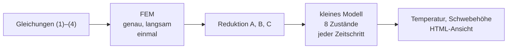
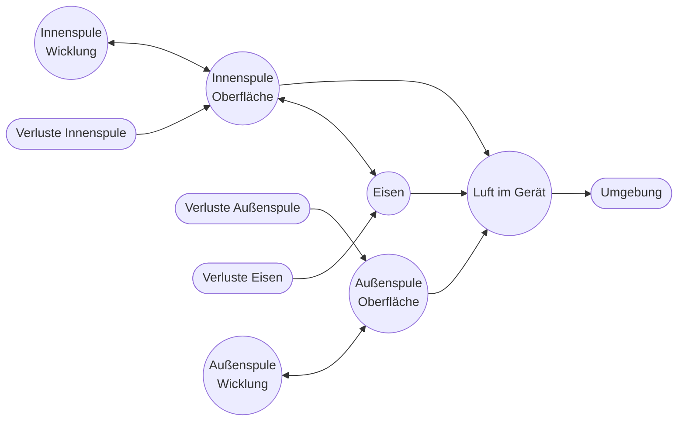
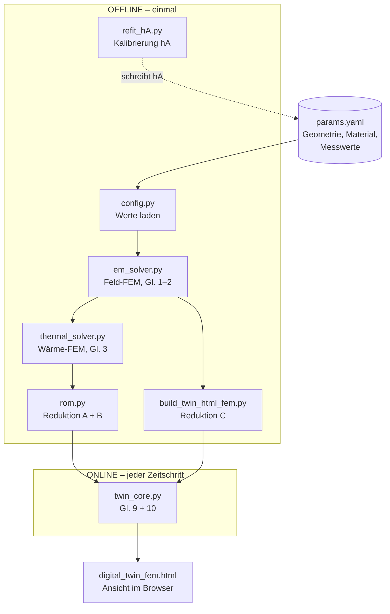

# Vom Feldmodell zum Echtzeit-Zwilling: Modellordnungsreduktion für die thermische Simulation eines elektrodynamischen Levitators

**Dang Minh Hoang, Marina Borchert, Mohamed Aziz El Majid**
Project Course Digital Twin, Summer Term 2026 · Betreuung: Prof. Dr. rer. nat. Dirk Hartmann, Dr.-Ing. Melina Merkel

> **Stand: 27.09.2026 · Version 3** (Version 2 bleibt unverändert erhalten)
> Änderungen gegenüber V2: Hauptteil auf etwa 7 Seiten gekürzt; Zusatzrechnungen und Code-Details in die Anhänge verschoben; Überschriften als Stichworte; Angaben zu Smartphone/AR, Temperatursensoren, PyVista und `xval_twin.py` entfernt, da nicht Teil des aktuellen Projektstands.

---

## 0. Kurzfassung

Ziel ist ein Modell, das die Temperatur von Aluminiumscheibe, Spulen und Eisen eines TEAM-28-ähnlichen Levitators aus dem Spulenstrom berechnet, und zwar schnell genug für eine laufende Darstellung. Die Physik wird als Feldgleichungen formuliert und mit der Finite-Elemente-Methode (FEM) gelöst. Dieses genaue, aber langsame Modell wird anschließend durch Modellordnungsreduktion (MOR) auf acht Zustandsgrößen verkleinert. Das Ergebnis läuft als Python-Simulation und wird als interaktive HTML-Seite im Browser dargestellt. Im stationären Zustand trifft das Modell die gemessenen Spulentemperaturen, auf die es kalibriert ist. Den zeitlichen Verlauf trifft es noch nicht; die Ursachen werden benannt.

---

## 1. Einleitung

Der Versuchsstand ist ein elektrodynamischer Levitator nach dem TEAM-Benchmark 28 [1]. Zwei Spulen mit 50-Hz-Wechselstrom erzeugen ein Magnetfeld. Es induziert in einer Aluminiumscheibe Ströme, die die Scheibe anheben. Dieselben Ströme erzeugen Wärme in Scheibe, Spulen und Eisen.

Diese Temperaturen sind schwer zu messen: Ein Fühler an der schwebenden Scheibe würde die Levitation stören, und das Innere der Wicklung ist nicht zugänglich. Der Spulenstrom dagegen ist leicht messbar. Ein Modell, das aus dem Strom die Temperatur berechnet, wirkt daher als **virtueller Sensor** [2]. Es muss drei Anforderungen erfüllen:

1. **schnell:** Ergebnisse in Echtzeit, ohne Wartezeit;
2. **physikalisch begründet:** aus den Grundgleichungen abgeleitet, nicht nur an Messkurven angepasst;
3. **kalibrierbar:** wenige unsichere Parameter, die sich an Messungen nachstellen lassen.

Genaue Modelle sind aber groß und langsam. Das Bindeglied ist die **Modellordnungsreduktion** [3]. Dieser Bericht zeigt sie am konkreten Beispiel.

**Aufbau.** Kap. 2 beschreibt das Problem, Kap. 3 die Methodik (FEM und Reduktion), Kap. 4 den Code, Kap. 5 die Ergebnisse, Kap. 6 den Ausblick. Zusatzrechnungen und Code-Details stehen in den Anhängen.

---

## 2. Problemstellung

Gesucht ist die **Temperaturverteilung im Gerät und ihr zeitlicher Verlauf**, wenn ein Wechselstrom durch die Spulen fließt. Dazu wird das Gerät zuerst **physikalisch** beschrieben: Welche Bauteile gibt es, wo entsteht Wärme, wie wird sie abgegeben (2.1)? Danach wird jeder physikalische Vorgang in eine **Gleichung** übersetzt (2.2). Diese Gleichungen löst Kap. 3.

### 2.1 Physikalisches Modell

**Aufbau.** Von innen nach außen: Eisenkern, Innenspule, Eisenring, Außenspule (Abb. 1). Darüber schwebt die Aluminiumscheibe. Die Anordnung ist drehsymmetrisch um die senkrechte Achse.

**Abb. 1 — Halber Querschnitt** (Maße in mm, aus `params.yaml`)

```
 r=0
  ┆  ┌──────────── Al-Scheibe, R=80, d=3 ─────────────────┐   ↕ Luftspalt
  ┆  └────────────────────────────────────────────────────┘
  ┆
  ┆┌─────────┐ ┌──────────────┐ ┌──────┐ ┌────────┐
  ┆│Eisenkern│ │ Innenspule   │ │Eisen-│ │ Außen- │
  ┆│         │ │ ca. 1000 Wdg.│ │ ring │ │ spule  │   Höhe 53
  ┆│         │ │   Kupfer     │ │      │ │ca.500 W│
  ┆└─────────┘ └──────────────┘ └──────┘ └────────┘
  └──────────┬──────────────┬────────┬──────────┬──→ r
           25,9           61,9     79,9      102,9
```

**Wirkprinzip.** Der Wechselstrom erzeugt ein Magnetfeld, das sich 50-mal pro Sekunde umpolt. Das Eisen bündelt das Feld. Das wechselnde Feld induziert in Scheibe und Eisen Kreisströme (Wirbelströme). Alle Ströme erzeugen Wärme: in den Spulen der Spulenstrom, in Scheibe und Eisen die Wirbelströme. Die Wärme verteilt sich im Material und geht an der Oberfläche an die Luft.

**Vereinfachungen.**

- **Drehsymmetrie:** Es genügt, eine Halbebene $(r,z)$ zu rechnen.
- **Konstante Umgebung:** 20 °C, wie mit den Betreuern vereinbart.
- **Konstanter Strom** als Standardfall (5 A). Im Modell ist der Strom frei einstellbar.
- **Feste Scheibenhöhe** in der Feldrechnung (Folgen: Kap. 5.3).

**Eingangsdaten.** Tabelle 1 zeigt die wichtigsten Eingangswerte und woher sie stammen. Die vollständige Liste steht in Anhang A.

**Tabelle 1 — Eingangsdaten des Modells**

| Größe | Wert | Herkunft |
|---|---|---|
| Radien von Kern, Spulen, Ring | 0–102,9 mm (Abb. 1) | gemessen (Lineal) |
| Höhe Kern/Spulen/Ring | 53 mm | gemessen |
| Windungszahl innen / außen | ca. 1000 / 500 | Angabe zum Aufbau |
| Scheibe: Radius / Dicke / Masse | 80 mm / 3 mm / 159 g | gemessen |
| Spulenstrom (Effektivwert) | 5,0 A (Betrieb), 7,8 A (Kalibrierung) | gemessen (Multimeter PeakTech 2005) |
| Frequenz | 50 Hz | Netz |
| Leitfähigkeit, Wärmedaten Al/Cu | Standardwerte | Literatur |
| Permeabilität Eisen $\mu_r$ | 1000 | **angenommen** |
| Wärmeübergänge an Scheibe und Luft | Schätzwerte | **angenommen** |
| Wärmeübergang der Spulen $hA$ | 2,47 / 2,89 W/K | **kalibriert** (Kap. 3.3.5) |
| Spulentemperatur bei 7,8 A (innen / außen) | 79 / 74 °C | gemessen (IR-Kamera, einmalig) |

Das Gerät hat **keine fest eingebauten Temperatursensoren**. Alle Temperaturmesswerte stammen aus einzelnen Aufnahmen mit einer IR-Kamera (23.06.2026).

### 2.2 Mathematisches Modell

Jeder Vorgang aus 2.1 wird durch eine Gleichung beschrieben. Tabelle 2 am Ende fasst sie zusammen.

#### 2.2.1 Magnetfeld

Berechnet wird das **magnetische Vektorpotential** $A_\varphi(r,z)$, aus dem sich das Feld ableitet. Da der Strom sinusförmig ist, genügen Amplitude und Phase, zusammengefasst in einer komplexen Zahl, dem **Phasor** [4]:

$$
-\nabla\cdot(\nu\nabla A_\varphi) + \frac{\nu}{r^2}A_\varphi + j\omega\sigma A_\varphi = J_s,\qquad \nu=\frac{1}{\mu_r\mu_0},\ \ \omega = 2\pi f. \tag{1}
$$

*In Worten:* Term 1 beschreibt die Ausbreitung des Felds (im Eisen besonders leicht). Term 2 folgt aus den Zylinderkoordinaten. Term 3 ist die Gegenwirkung der Wirbelströme. Rechts steht die Quelle, die Stromdichte in den Spulen.
→ *Python:* `em_solver.py`, Anhang B.2

#### 2.2.2 Wärmequelle

Aus dem Feld folgt die Wirbelstromdichte $J = -j\omega\sigma A_\varphi$ und daraus die mittlere Wärmeleistung pro Volumen:

$$
q(r,z) = \tfrac12\,\sigma\,\omega^2\,|A_\varphi|^2 \quad[\mathrm{W/m^3}]. \tag{2}
$$

In den Spulen gilt $P_{\mathrm{Cu}}=\tfrac12 I^2R$.
→ *Python:* `em_solver.py`, Funktion `compute_losses`, Anhang B.2

#### 2.2.3 Wärmeleitung

Die Wärme verteilt sich im Material und wird an der Oberfläche abgegeben:

$$
\rho c_p\frac{\partial T}{\partial t}=\nabla\cdot(k\nabla T)+q,\qquad -k\frac{\partial T}{\partial n}=h\,(T-T_\infty). \tag{3}
$$

*In Worten:* Ein Volumenelement erwärmt sich (links), wenn Wärme von Nachbarn zufließt oder vor Ort entsteht (rechts). Am Rand gibt es umso mehr Wärme ab, je wärmer es als die Luft ist.
→ *Python:* `thermal_solver.py`, Anhang B.3

#### 2.2.4 Temperaturabhängigkeit

Warme Metalle leiten schlechter:

$$
\sigma(T) = \frac{\sigma_0}{1+\alpha (T-T_0)},\qquad \alpha \approx 3{,}9\cdot10^{-3}\ \mathrm{K^{-1}}. \tag{4}
$$

Die Wirkung ist gegenläufig: Die Wirbelstromverluste der Scheibe sinken, die Spulenverluste steigen.

**Tabelle 2 — Das Modell auf einen Blick**

| Gl. | liefert | braucht | Kopplung |
|---|---|---|---|
| (1) Magnetfeld | $A_\varphi(r,z)$ | Geometrie, Material, Strom | → (2) |
| (2) Wärmequelle | $q(r,z)$, Leistung je Bauteil | $A_\varphi$ | → (3) |
| (3) Wärmeleitung | $T(r,z,t)$ | $q$, Wärmedaten, $h$ | → (4) |
| (4) Leitfähigkeit | Korrekturfaktor | Temperatur | → (1), langsam |

---

## 3. Methodik

### 3.1 Überblick

Die Gleichungen aus Kap. 2 werden in **zwei Stufen** gelöst (Abb. 2):

- **Offline (einmal):** Die FEM löst Gl. (1)–(3) genau. Das dauert etwa eine Sekunde und braucht Löserbibliotheken.
- **Online (laufend):** Ein daraus abgeleitetes, kleines Modell rechnet jeden Zeitschritt in Mikrosekunden, nur mit Grundrechenarten.

**Abb. 2 — Zwei Stufen**



Kap. 3.2 erklärt die FEM, Kap. 3.3 die Reduktion.

### 3.2 Finite-Elemente-Methode

#### 3.2.1 Numerisches Verfahren

Für ein Gerät mit fünf Materialbereichen gibt es keine Formellösung. Man zerlegt deshalb das Gebiet in kleine Stücke und löst die Gleichung stückweise näherungsweise. Die FEM ist dafür das Standardwerkzeug der TEAM-Benchmarks [1, 4]: Jedes Stück trägt seinen eigenen Materialwert, und Feld- und Wärmeproblem lassen sich mit demselben Programmgerüst lösen. Ein Vergleich mit anderen Verfahren steht in Anhang C.1.

#### 3.2.2 Diskretisierung

Die Ebene $(r,z)$ wird in kleine **Dreiecke** zerlegt (Netz). In jedem Dreieck ändert sich die gesuchte Größe linear. Sie ist dann durch ihre Werte an den Ecken (**Knoten**) festgelegt. Aus einer unbekannten Funktion werden so endlich viele unbekannte Zahlen.

Die Gleichung wird nicht in jedem Punkt, sondern **im Mittel um jeden Knoten** erfüllt. Physikalisch ist das eine Wärmebilanz um jeden Knoten (*schwache Form*):

$$
\int_\Omega k\nabla T\cdot\nabla v_i\,2\pi r\,dA + \oint_\Gamma hTv_i\,2\pi r\,ds = \int_\Omega q\,v_i\,2\pi r\,dA+\oint_\Gamma hT_\infty v_i\,2\pi r\,ds . \tag{5}
$$

*In Worten:* Wärmeleitung + Abgabe am Rand = erzeugte Wärme. Der Faktor $2\pi r$ berücksichtigt die Drehung um die Achse. $v_i$ ist eine „Zeltfunktion“, die am Knoten $i$ gleich 1 ist und zu den Nachbarn auf 0 abfällt.
→ *Python:* Elementformeln in Anhang D

#### 3.2.3 Gleichungssystem

Schreibt man Gl. (5) für alle Knoten auf, entsteht ein lineares Gleichungssystem:

$$
\mathbf K\,\mathbf T=\mathbf f,\qquad\text{zeitabhängig:}\quad \mathbf M\,\dot{\mathbf T}+\mathbf K\,\mathbf T=\mathbf f . \tag{6}
$$

$\mathbf T$ enthält alle Knotentemperaturen, $\mathbf K$ die Leitung, $\mathbf M$ die Wärmekapazität, $\mathbf f$ die Quellen. Fast alle Einträge von $\mathbf K$ sind null, weil nur Nachbarknoten gekoppelt sind. Für Gl. (1) läuft alles gleich, nur mit komplexen Zahlen.
→ *Python:* `scipy.sparse.linalg.spsolve` [5], Anhang B.2/B.3

#### 3.2.4 Modellgröße

Zwei physikalische Vereinfachungen halten das Problem klein:

- **Phasor statt Zeitschritt:** Das Feld schwingt 50-mal pro Sekunde, die Temperatur ändert sich über Minuten. Die Wärme spürt nur den Mittelwert, und genau den liefert Gl. (2).
- **Grobes Netz in Dickenrichtung:** Das Feld dringt in Aluminium bei 50 Hz etwa 12 mm tief ein, die Scheibe ist nur 3 mm dick. Der Wirbelstrom ist über die Dicke fast gleich.

Damit hat das Feldmodell rund 8700, das Wärmemodell der Scheibe rund 700 Unbekannte.

#### 3.2.5 Plausibilitätsprüfung

Eine FEM liefert immer Zahlen, auch bei Fehlern. Deshalb prüft der Code bei jedem Lauf Größen, deren richtiges Ergebnis bekannt ist:

1. **Energiebilanz:** Erzeugte Wärme = abgegebene Wärme. Ergebnis: Übereinstimmung auf Rundungsgenauigkeit.
2. **Gebietsgröße:** Zwei verschiedene Randbedingungen am Außenrand ergeben nahezu dieselben Verluste (Abweichung < 1 %). Das Rechengebiet ist also groß genug.
3. **Linearität:** Doppelter Strom ergibt vierfache Verluste.

### 3.3 Modellordnungsreduktion

#### 3.3.1 Grundidee

Die FEM ist genau, aber für jeden neuen Strom und jeden Zeitschritt müsste sie neu gelöst werden. Die Reduktion nutzt aus, dass die Tausenden Unbekannten **nicht unabhängig** sind: Beim Aufheizen ändert sich vor allem, *wie warm* die Scheibe ist, kaum aber, *wo* sie wärmer ist.

> **Analogie:** Ein Foto, das nur heller oder dunkler wird. Man speichert das Bild einmal und merkt sich pro Moment nur einen Helligkeitsfaktor.

Mathematisch wird das Feld als Summe weniger fester „Bilder“ $\mathbf v_k$ mit zeitabhängigen Gewichten $\beta_k(t)$ geschrieben [6]:

$$
\mathbf T(t)\approx T_\infty+\sum_{k=1}^{r}\beta_k(t)\,\mathbf v_k,\qquad r \ll N . \tag{7}
$$

Drei Reduktionen setzen diese Idee um (Tabelle 3).

#### 3.3.2 Reduktion A: Strom-Skalierung

Gl. (1) ist **linear**: Doppelter Strom ergibt doppeltes Feld, an jedem Ort gleich. Nach Gl. (2) vervierfacht sich dann die Wärmequelle, ebenfalls überall gleich. Die *Form* der Verlustverteilung bleibt, nur ihre Höhe ändert sich. Die Feld-FEM wird daher nur **einmal** bei $I_{\text{ref}}=5$ A gelöst. Für jeden Strom gilt dann:

$$
q(r,z;I,T)=\hat q(r,z)\cdot\Big(\frac{I}{I_{\mathrm{ref}}}\Big)^{2}\cdot\frac{\sigma(T)}{\sigma(T_{\mathrm{ref}})} . \tag{8}
$$

Gültig ist das, solange das Eisen nicht magnetisch sättigt. Am Betriebspunkt ist das erfüllt; bei höheren Strömen wird es knapp (Abschätzung in Anhang C.4).
→ *Python:* `rom.py` und `twin_core.py`, Anhang B.4/B.5

#### 3.3.3 Reduktion B: eine Temperaturform für die Scheibe

Aluminium leitet Wärme sehr gut, die Scheibe ist dünn und gibt Wärme nur langsam an die Luft ab. Die Scheibe ist daher fast überall gleich warm. Als einziges „Bild“ dient das stationäre FEM-Temperaturfeld $\Delta T_{\text{ref}}(r,z)$. Aus Gl. (7) wird eine einzige Gleichung für das Gewicht $\beta(t)$:

$$
\tau\,\dot\beta=\Big(\frac{I}{I_{\mathrm{ref}}}\Big)^{2}s-\beta,\qquad T(r,z,t)=T_\infty+\beta(t)\,\Delta T_{\mathrm{ref}}(r,z). \tag{9}
$$

*In Worten:* $\beta=0$ heißt kalt, $\beta=1$ so warm wie im Referenzfall. $\beta$ strebt dem Zielwert $(I/I_{\text{ref}})^2 s$ zu ($s$: Leitfähigkeitsfaktor aus Gl. 4). Die Zeitkonstante $\tau$ (rund 4 Minuten) gibt das Tempo an.
Dass eine einzige Form genügt, ist durch eine Eigenwertanalyse und einen Vergleich mit der vollen FEM belegt (Anhang C.2, C.3).
→ *Python:* `rom.py`, Anhang B.4

#### 3.3.4 Reduktion C: RC-Netzwerk für Spulen und Eisen

Spulen und Eisen werden durch wenige Temperaturknoten beschrieben, wie ein elektrischer Schaltkreis: Wärmekapazität ≙ Kondensator, Wärmeleitwert ≙ Widerstand [7]. Für jeden Knoten $i$ gilt:

$$
C_i\,\dot T_i=P_i(I)+\sum_j G_{ij}(T_j-T_i)-hA_i\,(T_i-T_{\mathrm{Luft}}). \tag{10}
$$

*In Worten:* Ein Knoten wird wärmer durch Verlustleistung und Wärme von wärmeren Nachbarn, er kühlt durch Abgabe an die Luft.

Das Netz hat sechs Knoten (Abb. 3). Jede Spule hat zwei: die sichtbare Oberfläche und das träge Wicklungsinnere. Dazu kommen Eisen und die Luft im Gerät. Die Zahlenwerte stehen in Anhang A.

**Abb. 3 — Thermisches RC-Netzwerk**



→ *Python:* `twin_core.py`, Anhang B.5

#### 3.3.5 Kalibrierung

Die zwei wichtigsten Parameter, die Wärmeübergänge der Spulen $hA_{\text{innen}}$ und $hA_{\text{außen}}$, werden so eingestellt, dass das Modell die IR-Messung bei 7,8 A trifft (79 / 74 °C). Ein Suchverfahren variiert beide Werte, bis das **laufende** Modell genau diese Temperaturen erreicht.
→ *Python:* `refit_hA.py`, Anhang B.6

#### 3.3.6 Ergebnis der Reduktion

**Tabelle 3 — Die drei Reduktionen**

| | Grund | vorher | nachher | Grenze |
|---|---|---|---|---|
| A: Strom-Skalierung | Gl. (1) ist linear | 8700 komplexe Unbekannte | 1 Multiplikation | Sättigung des Eisens |
| B: eine Form | Scheibe fast gleich warm | ca. 700 Unbekannte | 2 Gewichte $\beta$ | Anhang C.3 |
| C: RC-Netz | Spulen/Eisen kompakt | – | 6 Knoten | Parameter teils geschätzt |

Aus mehreren Tausend Unbekannten werden **acht Zustandsgrößen**. Ein Zeitschritt ist reine Arithmetik und dauert Mikrosekunden statt Sekunden.

---

## 4. Berechnungswerkzeug

Der Code ist in Python geschrieben (NumPy, SciPy [5]). Alle Zahlenwerte stehen in einer einzigen Datei, `params.yaml`. Abb. 4 zeigt den Datenfluss. Was jedes Modul einliest, wie es rechnet und welches Verfahren es nutzt, erklärt Anhang B in einfachen Worten.

**Abb. 4 — Datenfluss durch den Code**



**Starten.** `RUN.py` im Projektordner (bzw. Doppelklick auf `RUN.command`) rechnet bei Bedarf neu und öffnet die HTML-Ansicht im Browser.

**Stromeingang.** Standardmäßig ist der Strom fest (5 A) oder über einen Schieberegler einstellbar. Ein Stromsensor (ACS712 am Arduino) ist softwareseitig vorbereitet (`data_io.py`); der Einbau am Versuchsstand ist in Arbeit.

---

## 5. Ergebnisse

### 5.1 Verlustleistungen

**Tabelle 4 — Verluste aus der Feld-FEM** (5 A, 20 °C)

| Quelle | P [W] | Anteil |
|---|---|---|
| Wirbelstrom Scheibe | 25,81 | 19 % |
| Wirbelstrom Eisen | 5,86 | 4 % |
| Innenspule | 52,32 | 38 % |
| Außenspule | 54,12 | 39 % |
| **Gesamt** | **138,11** | 100 % |

Die Spulen erzeugen rund drei Viertel der Wärme. Das passt dazu, dass sie im Wärmebild die heißesten Bauteile sind. (Zur Stromkonvention Effektivwert/Amplitude: Anhang C.5.)

### 5.2 Vergleich mit der Messung

**Tabelle 5 — Messwert gegen Modell**

| Messgröße | Messung | Modell | Differenz | Bewertung |
|---|---|---|---|---|
| Innenspule, stationär, 7,8 A | 79 °C | 79,0 °C | 0 | kalibriert, kein Nachweis |
| Außenspule, stationär, 7,8 A | 74 °C | 74,0 °C | 0 | kalibriert, kein Nachweis |
| Außenspule, Rampe, t = 140 s | 40,0 °C | 33,6 °C | −6,5 K | Vorhersage |
| Außenspule, Rampe, t = 200 s | 43,0 °C | 34,7 °C | −8,3 K | Vorhersage |
| Außenspule, Rampe, t = 300 s | 48,5 °C | 36,2 °C | −12,3 K | Vorhersage |
| Außenspule, Rampe, t = 360 s | 55,8 °C | 40,0 °C | −15,8 K | Vorhersage |
| Außenspule, Rampe, t = 450 s | 56,0 °C | 43,6 °C | −12,4 K | Vorhersage |
| Scheibe, stationär, 7,8 A | 37–40 °C | 107 °C | ≈ +68 K | IR unzuverlässig |
| Schwebehöhe (sichtbar), 5 A | 7–8 mm | 14,7 mm | ≈ +7 mm | Vorhersage |

**Kurz zusammengefasst:**

- **Spulen, stationär:** exakt, aber nur, weil darauf kalibriert wurde.
- **Spulen, Zeitverlauf:** Das Modell heizt zu langsam auf (mittlerer Fehler 11,5 K).
- **Scheibe:** Die IR-Kamera misst auf blankem Aluminium zu tief; ein Urteil ist nicht möglich.
- **Schwebehöhe:** Das Modell überschätzt den Spalt um etwa 7 mm.

### 5.3 Ursachen der Abweichungen

- **Zeitverlauf zu langsam:** Die Endtemperatur hängt nur von den kalibrierten Wärmeübergängen ab. Das Tempo hängt dagegen von den Wärmekapazitäten und der Aufteilung Oberfläche/Wicklung ab. Diese lassen sich aus einer Aufheizkurve allein nicht bestimmen; dafür fehlt eine **Abkühlkurve**.
- **Scheibe:** Blankes Aluminium strahlt wenig Wärme ab und spiegelt die Umgebung. Die Kamera zeigt daher zu tiefe Werte. Abhilfe: ein mattschwarzer Messfleck.
- **Schwebehöhe:** Wahrscheinlichste Ursache ist die angenommene Eisenpermeabilität $\mu_r = 1000$. Sie wurde bewusst *nicht* nachträglich an die Beobachtung angepasst. Zudem rechnet das Feldmodell mit fester Scheibenhöhe.

---

## 6. Ausblick

Fast alle Abweichungen haben dieselbe Ursache: Es fehlen Messdaten. Die nächsten Schritte sind daher:

1. **Abkühlkurve** der Spulen aufnehmen → Zeitverlauf kalibrieren;
2. **mattschwarzer Messfleck** auf Scheibe und Eisen → verlässliche IR-Werte;
3. **Eisenpermeabilität** messen → Schwebehöhe klären;
4. **Stromsensor** einbauen → Modell läuft mit dem gemessenen Strom statt mit einem festen Wert;
5. **unabhängiger Messpunkt bei 5 A** → Kalibrierung prüfen, nicht nur anpassen.

Das Vorgehen — FEM einmal lösen, Reduzierbarkeit prüfen, online ein kleines Modell rechnen — lässt sich auf 3D-Modelle übertragen [2, 3].

---

## Anhang A — Mess- und Rechenwerte

**A.1 Messwerte und Annahmen (Eingang ins Modell)**

| Größe | Wert | Herkunft |
|---|---|---|
| Strom Betrieb / Kalibrierung | 5,0 / 7,8 A eff., 50 Hz | gemessen (Multimeter) |
| Variac-Stellung | 220° ≈ 195 V → 5 A; 270° (max.) ≈ 240 V → 7,8 A | gemessen (Stellwinkel) |
| Radien (Kern / Innenspule / Ring / Außenspule) | 0–25,9 / 27,9–61,9 / 64,9–79,9 / 82,9–102,9 mm | gemessen (Lineal, 10.07.2026) |
| Höhe Kern/Spulen/Ring | 53 mm | gemessen |
| Scheibe R / d / Masse | 80 mm / 3 mm / 159 g | gemessen |
| Windungszahl innen / außen | ca. 1000 / 500 | Angabe zum Aufbau |
| σ Al / Cu | 34 / 59,6 MS/m | Literatur |
| Al: k, ρ, c_p, α | 237 W/(m K), 2700 kg/m³, 900 J/(kg K), 3,9·10⁻³ 1/K | Literatur |
| Eisen μ_r / σ / B_sat | 1000 / 1 MS/m / 1,5 T | angenommen |
| Draht / Füllfaktor | 1,2 mm / 0,6 | angenommen |
| h Scheibe oben / unten | 10 / 25 W/(m² K) | angenommen |
| Luftknoten C / hA | 3000 J/K / 40 W/K | angenommen |
| hA innen / außen | 2,474 / 2,889 W/K | kalibriert |
| IR stationär 7,8 A, 29 °C | Innenspule 79, Außenspule 74, Kern 45, Scheibe 37–40 °C | gemessen (IR, 23.06.2026) |
| IR Rampe Außenspule | 40 / 43 / 48,5 / 55,75 / 56 °C bei 140 / 200 / 300 / 360 / 450 s | gemessen (Zeit ±10 s) |
| Schwebehöhe sichtbar, 5 A | 7–8 mm | beobachtet |

**A.2 Rechenwerte (Ausgabe des Modells)**

Kennung = Zeile in `report_numbers_output.txt`.

| Kennung | Größe | Wert |
|---|---|---|
| E1 | Feld-FEM: Knoten / Dreiecke / Rechenzeit | 8700 / 17 028 / 0,40 s |
| E2 | Verlustrechnung inkl. Eisenkorrektur | 1,3 s |
| E3, E4 | Verluste Scheibe / Eisen / Innen / Außen | 25,81 / 5,86 / 52,32 / 54,12 W |
| E6 | Verlustverhältnis bei doppeltem Strom | 4,000 (linear), 4,009 mit Eisenkorrektur |
| E7 | Gebietsgröße, größte Abweichung | 0,77 % |
| T1 | Wärme-FEM: Knoten / Dreiecke / Rechenzeit | 697 / 1280 / 0,03 s |
| T2 | Energiebilanz | 25,81388 W = 25,81388 W |
| R1 | Scheibe C / UA / τ | 146,6 J/K / 0,600 W/K / 244 s |
| L1 | Wärmekapazitäten Spule Oberfläche / Wicklung | innen 247 / 854, außen 255 / 884 J/K; Eisen 1676 J/K |
| L3 | stationär 7,8 A / 29 °C | Spule 79,0 / 74,0; Eisen 83,7; Wicklung 178 / 176; Scheibe 107 °C |
| L3 | stationär 5 A / 20 °C | Spule 44,0 / 41,5; Eisen 46,3; Wicklung 85 / 84; Scheibe 58 °C |
| L4, L5 | Rampe | Tabelle 5; RMS 11,5 K |
| L6 | ein Online-Zeitschritt | ≈ 3 µs |
| V1 | Schwebehöhe | 11,7 mm (Unterkante), 14,7 mm sichtbar |

Hinweis: Die Wicklungstemperatur von 178 °C bei 7,8 A ist nicht gemessen und vermutlich zu hoch, weil der innere Wärmeleitwert nur geschätzt ist (vgl. Kap. 5.3).

## Anhang B — Umsetzung im Code

Jedes Modul wird nach demselben Schema beschrieben: **Was kommt rein? Was passiert? Mit welchem Verfahren?**

**B.1 `config.py` — Werte laden**
- *Rein:* die Datei `params.yaml`.
- *Was passiert:* Alle Zahlen werden gelesen, Millimeter in Meter umgerechnet und abgeleitete Werte gebildet, z. B. Spitzenstrom = Effektivwert · √2.
- *Verfahren:* einfaches Einlesen (Bibliothek PyYAML); keine Rechnung.

**B.2 `em_solver.py` — Magnetfeld und Wärmequelle (Gl. 1, 2)**
- *Rein:* Geometrie, Materialwerte, Strom.
- *Was passiert:* (1) Das Gebiet (1 m × 1 m) wird in Dreiecke zerlegt, fein am Gerät, grob weiter weg. (2) Jedes Dreieck bekommt seine Materialwerte. (3) Für jedes Dreieck wird ein kleiner Beitrag zur großen Matrix berechnet und eingetragen. (4) Das Gleichungssystem wird gelöst. (5) Das Eisen wird nachkorrigiert, falls das Feld stark ist. (6) Aus dem Feld wird Gl. (2) berechnet und über jedes Bauteil aufsummiert.
- *Verfahren:* FEM mit linearen Dreiecken; Lösen mit `scipy.sparse.linalg.spsolve` (direktes Verfahren, ähnlich dem Gauß-Verfahren aus der Schule, aber für sehr große, fast leere Matrizen).
- *Raus:* Verlustkarte der Scheibe, Leistung je Bauteil, Hubkraft.

**B.3 `thermal_solver.py` — Temperatur der Scheibe (Gl. 3, 5)**
- *Rein:* Verlustkarte aus B.2, Wärmedaten, Wärmeübergänge.
- *Was passiert:* Die Verlustkarte wird auf ein feineres Netz der Scheibe übertragen, Gl. (5) als Gleichungssystem aufgestellt und gelöst. Danach wird geprüft, ob erzeugte = abgegebene Wärme.
- *Verfahren:* FEM, `spsolve`, lineare Interpolation.
- *Raus:* stationäres Temperaturfeld der Scheibe.

**B.4 `rom.py` — Reduktion A und B (Gl. 8, 9)**
- *Rein:* Temperaturfeld aus B.3.
- *Was passiert:* Das Temperaturfeld wird als „Bild“ $\Delta T_{\text{ref}}$ gespeichert. Aus Masse und Wärmeabgabe werden Wärmekapazität $C$, Abgabe $UA$ und Zeitkonstante $\tau = C/UA$ berechnet.
- *Verfahren:* Energiebilanz eines einzelnen Körpers; zur Kontrolle numerische Zeitintegration (`scipy.integrate.solve_ivp`).
- *Raus:* $\Delta T_{\text{ref}}$, $\tau$.

**B.5 `twin_core.py` — das Online-Modell (Gl. 9, 10)**
- *Rein:* aktueller Strom $I$, Zeitschritt $\Delta t$, alle Koeffizienten aus B.4 und dem RC-Netz.
- *Was passiert pro Zeitschritt:* (1) Verluste mit $(I/I_{\text{ref}})^2$ skalieren. (2) Jede Temperatur um „Änderungsrate × Zeitschritt“ weiterschieben. (3) Ist der Zeitschritt zu groß, wird er in kleinere Teilschritte zerlegt, damit die Rechnung stabil bleibt. (4) Schwebehöhe mit einer fertigen Formel für eine gedämpfte Schwingung berechnen.
- *Verfahren:* explizites Euler-Verfahren („neuer Wert = alter Wert + Steigung × Schrittweite“); nur NumPy und Standardbibliothek.
- *Raus:* Temperaturen aller Knoten, Temperaturfeld der Scheibe, Schwebehöhe.

**B.6 `refit_hA.py` — Kalibrierung**
- *Rein:* gemessene Spulentemperaturen (79 / 74 °C bei 7,8 A).
- *Was passiert:* Das Programm probiert Werte für $hA_{\text{innen}}$ und $hA_{\text{außen}}$, lässt das Online-Modell jeweils bis zum Gleichgewicht laufen und vergleicht mit der Messung, bis die Differenz null ist.
- *Verfahren:* Nullstellensuche (`scipy.optimize.fsolve`).
- *Raus:* kalibrierte $hA$-Werte in `params.yaml`.

**B.7 `build_twin_html_fem.py` — Reduktion C und HTML-Ansicht**
- *Rein:* Ergebnisse aus B.2–B.4, Geometrie.
- *Was passiert:* Die Parameter des RC-Netzes werden berechnet (Kapazitäten aus Volumen und Werkstoff). Alle Koeffizienten und das Online-Modell werden als JavaScript in eine HTML-Datei geschrieben, damit die Ansicht ohne Python im Browser läuft.
- *Raus:* `outputs/digital_twin_fem.html`.

**B.8 `data_io.py` — Stromeingang (vorbereitet)**
- *Rein:* Strommesswerte als CSV (vom Arduino oder aus einer Datei).
- *Was passiert:* Jeder Messwert wird an `twin_core.py` übergeben.
- *Stand:* mit Testdaten geprüft; Sensor noch nicht am Versuchsstand eingebaut.

## Anhang C — Zusatzrechnungen

**C.1 Vergleich numerischer Verfahren.** Finite Differenzen brauchen an jeder Materialgrenze eine Sonderbehandlung; Randelemente führen zu voll besetzten Matrizen und sind bei vielen Materialbereichen aufwendig; Finite Volumen wären möglich. Die FEM behandelt Materialsprünge, Drehsymmetrie ($2\pi r$) und Konvektionsränder ohne Zusatzaufwand und ist Standard für TEAM-Benchmarks.

**C.2 Eigenwertanalyse.** Ohne Quelle gilt $\mathbf M\dot{\mathbf T} = -\mathbf K\mathbf T$. Die Eigenformen aus $\mathbf K\boldsymbol\varphi = \lambda\mathbf M\boldsymbol\varphi$ klingen mit $\tau_i = 1/\lambda_i$ ab. Ergebnis: $\tau_1 = 204$ s, $\tau_2 = 4{,}4$ s, Verhältnis 47 (Abb. C1). Alle Formen außer der ersten sind nach wenigen Sekunden abgeklungen; deshalb genügt eine Form.


**Abb. C1 — Zeitkonstanten der sechs langsamsten Eigenformen** [R5]

**C.3 Reduziertes Modell gegen volle FEM.** Beide heizen die Scheibe bei 5 A auf (Abb. C2). Mit $\tau_1$ aus C.2 beträgt der größte Fehler 0,36 K (0,8 %). Mit der im Code verwendeten Zeitkonstante $\tau = C/UA = 244$ s sind es bis zu 3,0 K während des Aufheizens, beim Endwert 0. Grund: $UA$ wird gegen 20 °C gebildet, die Scheibenunterseite sieht aber von den Spulen auf 30 °C vorgewärmte Luft [R4, R6].


**Abb. C2 — Aufheizen der Scheibe: volle FEM gegen reduziertes Modell** [R6]

**C.4 Magnetische Sättigung.** Bei konstantem $\mu_r$ ist die Flussdichte proportional zum Strom. Linear hochgerechnet aus der FEM: Spitzenwert im Eisen ca. 0,96 T bei 5 A eff. (64 % von 1,5 T) und ca. 1,5 T bei 7,8 A eff. Bei 7,8 A ist Reduktion A daher nur näherungsweise gültig. Die lineare Hochrechnung überschätzt leicht [E5].

**C.5 Stromkonvention.** Gemessen wird der Effektivwert (5 A). Die Verlustrechnung setzt ihn als Amplitude ein; die Wattzahlen in Tabelle 4 sind daher um den Faktor 2 zu klein. Für die Temperatur ist das unschädlich, weil der Faktor bei der Kalibrierung von $hA$ aufgefangen wird. Die Kraftrechnung verwendet die echte Amplitude $\sqrt2\cdot5 = 7{,}07$ A.

**C.6 Skintiefe und Biot-Zahl.** $\delta = \sqrt{2/(\omega\mu_0\sigma)} = 12{,}2$ mm $\gg$ 3 mm. $\mathrm{Bi} = h\,(d/2)/k = 25\cdot0{,}0015/237 = 1{,}6\cdot10^{-4} \ll 0{,}1$: Die Scheibe ist nahezu gleichmäßig warm.

**C.7 Zeitkonstante.** $C = \rho c_p \pi R^2 d = 146{,}6$ J/K; $UA = P_{\text{ref}}/\overline{\Delta T} = 25{,}81/43{,}03 = 0{,}600$ W/K; $\tau = C/UA = 244$ s.

## Anhang D — FEM-Details

**Elemente.** Lineare Dreiecke. Mit Fläche $A_e$, Schwerpunktradius $r_c$ und konstanten Gradienten $b_k$, $c_k$ der Ansatzfunktionen: $\mathbf K_e = 2\pi k\,(\mathbf b\mathbf b^\top + \mathbf c\mathbf c^\top)\,A_e\,r_c$.

**Konvektionsrand.** Randkante der Länge $L$ zwischen den Radien $r_a$, $r_b$:
$\mathbf K_{\text{Kante}} = 2\pi h\,\frac{L}{12}\begin{pmatrix}3r_a+r_b & r_a+r_b\\ r_a+r_b & r_a+3r_b\end{pmatrix}$.

**Randbedingungen.** Feld: $A_\varphi = 0$ auf der Achse und am Außenrand (Kontrolle mit Neumann-Rand). Wärme: Die Achse braucht keine Bedingung, da $2\pi r$ dort verschwindet.

**Löser.** Direkte LU-Zerlegung (`spsolve`); das Feldsystem wird komplex gelöst. Die Eisenpermeabilität wird iterativ an die Flussdichte angepasst (Konvergenz nach 2 Iterationen).

## Anhang E — Reproduktion

```bash
# im Repository-Stamm
python RUN.py                                          # rechnen + HTML-Ansicht öffnen
.venv/bin/python projectseminar_DT4TM_report/report_numbers.py            # alle Rechenwerte (Anhang A.2)
.venv/bin/python projectseminar_DT4TM_report/report_numbers.py --figure   # Abb. C1 und C2
python refit_hA.py                                     # Kalibrierung hA
```

---

## Literatur

1. International Compumag Society, „Description of TEAM workshop problem 28: An electrodynamic levitation device“, https://www.compumag.org/jsite/images/stories/TEAM/problem28.pdf
2. D. Hartmann, H. Van der Auweraer, „Digital Twins – a golden age for industrial mathematics“, *Journal of Mathematics in Industry*, 15:6, 2025. doi:10.1186/s13362-025-00170-3
3. D. Hartmann, M. Herz, U. Wever, „Model Order Reduction a Key Technology for Digital Twins“, in: *Reduced-Order Modeling (ROM) for Simulation and Optimization*, Springer, 2018, S. 167–179. doi:10.1007/978-3-319-75319-5_8
4. O. Bíró, K. Preis, „On the use of the magnetic vector potential in the finite-element analysis of three-dimensional eddy currents“, *IEEE Trans. Magnetics*, 25(4), S. 3145–3159, 1989.
5. P. Virtanen et al., „SciPy 1.0: Fundamental algorithms for scientific computing in Python“, *Nature Methods*, 17, S. 261–272, 2020.
6. P. Benner, S. Gugercin, K. Willcox, „A Survey of Projection-Based Model Reduction Methods for Parametric Dynamical Systems“, *SIAM Review*, 57(4), S. 483–531, 2015. doi:10.1137/130932715
7. O. Wallscheid, „Thermal monitoring of electric motors: State-of-the-art review and future challenges“, *IEEE Open Journal of the Industry Applications Society*, 2, S. 204–223, 2021.
